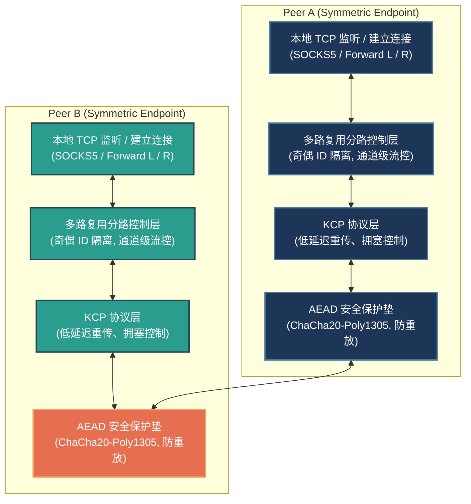

# BiTun (Bi-directional Tunnel)

[](LICENSE)
[]()
[]()

**BiTun** 是一个用纯 C 语言编写的、完全对称的、基于 KCP 与 UDP 的双向全双工加密通道工具。它不仅实现了强大的对称打洞与连接迁移能力，还融合了 ChaCha20-Poly1305 AEAD 加密、滑动窗口防重放、以及通道级流控设计。

通过单一加密隧道，BiTun 同时支持了**动态 SOCKS5 代理（类似 `ssh -D`）**、**本地静态端口转发（类似 `ssh -L`）**和**远端反向静态转发（类似 `ssh -R`）**。

> 🌐 **多语言文档 / Multi-language Documentation**:
> *   [English Version](docs/README.en.md)
> *   [日本語版](docs/README.ja.md)
> *   [系统设计说明书 (design.md)](docs/design.md) (设计细节位于 `/home/chenming/BiTun/docs/design.md`)
> *   [一致性与测试验证报告 (verification_report.md)](docs/verification_report.md)

---

## 📐 系统架构与数据流向 (System Architecture)



### 流量平移数据流向 (Traffic Flows)

#### 1. 动态 SOCKS5 代理模式 (ssh -D)


#### 2. 本地静态端口转发模式 (ssh -L)


#### 3. 远端反向静态转发模式 (ssh -R)


---

## 🚀 系统设计特点 (System Features)

1. **完全对称对等端架构 (Fully Symmetric Peer-to-Peer)**
   * 两端运行完全相同的程序与状态机，不区分传统的客户端/服务端（Client/Server）。
   * 支持**双向对称打洞**与**被动监听/动态学习（Passive/Dynamic Learning）**模式。若一端配置为被动模式，它将通过收到的首个合法 UDP 包反射学习对端的 IP:Port 并绑定，实现灵活的单/双向打洞。
2. **KCP 可靠传输与多路复用 (KCP & Channel Multiplexing)**
   * 在 UDP 之上集成了 KCP 可靠协议，提供低延迟、快速重传的 ARQ 流控。
   * 在单个 KCP 连接上实现多路复用，每个活跃通道（Channel）映射一个应用层 TCP 连接，分配奇偶 Channel ID 隔离双端并发。
3. **极高等级的安全防线 (AEAD & Anti-Replay)**
   * **全流量 AEAD 加密**：UDP 与 KCP 之间配有 ChaCha20-Poly1305 安全垫，所有数据及控制帧均在公网密文传输。
   * **会话密钥派生**：静态 PSK 仅用于认证。在握手期通过两端随机数利用 **HKDF-SHA256** 派生临时的 Ephemeral Session Key，彻底消除设备重启导致的 Nonce 重用风险。
   * **滑动窗口防重放**：接收端前置 IPsec 风格的 64 位防重放滑动窗口，过滤并静默丢弃任何重放包。
4. **安全凭证快速重置 (Authenticated Fast Reconnection)**
   * 对端意外重启时，会发出携带静态 PSK 签名的 `AUTH_RESET` 重置帧。已连接端在通过时间戳容差（±5s）及 HMAC 完整性校验后，会**在毫秒级内主动销毁旧连接并响应重连**，避免了传统安全过滤器屏蔽重连报文引发的 30 秒超时挂死。
5. **连接无感迁移 (Connection Migration)**
   * 当对端因 Wi-Fi/蜂窝切换或对称 NAT 端口重映射导致公网 IP:Port 发生突变时，只要新来源的数据包通过了 AEAD 解密校验，系统会自动平滑更新对端目标地址，**KCP 状态与应用层 TCP 流量无感保持**。
6. **精细化流控与背压 (Flow Control & Backpressure)**
   * **发送侧背压**：监控 KCP 待发队列（`waitsnd >= 32`），挂起本地 TCP 的 `EPOLLIN` 触发读取，并配合单通道单次 2KB 读取限流，确保系统 Heap 安全，杜绝 OOM。
   * **接收侧通道级流控**：借鉴 SSH/HTTP2 机制，各 Channel 维护独立的 4KB 滑动窗口并以 `CMD_WINDOW_UPDATE (0x06)` 推进，彻底解决了“慢消费通道卡死快通道”的**队头阻塞 (HOL Blocking)** 隐患。

---

## 📂 目录结构 (Directory Layout)

```text
.
├── LICENSE             # 开源许可证 (Apache 2.0)
├── Makefile            # 构建脚本
├── README.md           # 中文 README (本文档)
├── run_integration_test.sh # 一键集成测试脚本
├── docs/               # 文档目录
│   ├── README.en.md    # 英文版 README
│   ├── README.ja.md    # 日文版 README
│   ├── design.md       # 系统设计说明书
│   ├── verification_report.md # 一致性与测试验证报告
│   ├── bitun_osal_design.md   # OSAL 设计说明书
│   ├── final_osal_spec.md     # OSAL 接口规格说明书
│   ├── task_plan.md           # 任务规划书
│   ├── dependence_analysis.md # 依赖分析报告
│   ├── adversarial_report.md  # 对抗性测试报告
│   ├── audit_report.md        # 审计报告
│   ├── implementation_task_plan.md           # 实现任务规划书
│   ├── implementation_submission.md          # 实现提交说明
│   ├── implementation_adversarial_report.md  # 实现对抗性测试报告
│   └── implementation_audit_report.md        # 实现审计报告
└── src/                # 源码目录
    ├── bitun_osal.h    # 跨平台统一操作系统抽象层接口
    ├── encrypt.c/h     # AEAD 加密、HKDF、防重放滑动窗口实现
    ├── ikcp.c/h        # KCP 协议核心源码
    ├── socks5.c/h      # 流式无状态 SOCKS5 协议解析器
    ├── tunnel.c/h      # 对称隧道状态机、事件循环、多路复用与流控
    ├── main.c          # 命令行入口及配置解析
    └── linux/          # Linux 平台具体实现
        ├── bitun_osal.c # Linux 平台具体实现
        └── test_bitun_osal.c # OSAL 单元测试用例
```

---

## 🛠️ 编译与安装 (Compilation)

### 前置依赖
* Linux 操作系统
* GCC 编译器与 GNU Make
* OpenSSL 开发库（提供 `libcrypto`，用于 ChaCha20-Poly1305 与 HMAC/HKDF 运算）

### 一键编译
在项目根目录下执行：
```bash
make
```
编译成功后，将在根目录下生成可执行二进制文件 `bitun`。

### 清理编译
```bash
make clean
```

---

## 🧪 测试与验证

### 编译与运行 OSAL 单元测试
在项目根目录下，执行以下命令编译并运行操作系统抽象层（OSAL）的单元测试：
```bash
gcc -O2 -Wall -Wextra -pthread -Isrc -o test_bitun_osal src/linux/test_bitun_osal.c src/linux/bitun_osal.c -lcrypto -lpthread
./test_bitun_osal
rm test_bitun_osal
```

### 运行系统集成测试
在项目根目录下，执行以下命令运行完整的一键集成测试：
```bash
bash run_integration_test.sh
```

---

## 📖 详细使用说明 (Usage)

### 命令行参数语法
```text
bitun -m <mode> -p <local_port> [-r <remote_ip:remote_port>] [-t <target_ip:target_port>] -k <psk> [--odd | --even]
```
* `-m, --mode`：运行模式。可选 `socks5`（动态代理）、`forward_l`（本地静态转发）、`forward_r`（远端静态转发）。
* `-p, --port`：本地绑定端口。在 `socks5`/`forward_l` 模式下也作为本地 TCP 监听端口。
* `-r, --remote`：对端 UDP 通信地址（`IP:Port`）。**若省略此参数，则本端进入被动监听/动态学习模式**。
* `-t, --target`：目标映射地址（`IP:Port`）。静态转发模式（`forward_l` / `forward_r`）下为必填项。
* `-k, --psk`：预共享密钥（PSK，将自动处理为 32 字节密钥）。
* `--odd` / `--even`：设置本端生成通道 ID 时是生成奇数还是偶数。两端必须一端为 odd，另一端为 even 以规避并发冲突。

---

### 💡 典型应用场景配置

#### 场景 1：双向 SOCKS5 动态代理 (双进程本地模拟)
* **Peer A** (在 UDP 9000 端口提供 SOCKS5 代理，主动向 Peer B 打洞，奇数 ID 侧)：
  ```bash
  ./bitun -m socks5 -p 9000 -r 127.0.0.1:9001 -k MySecretPSKKey123456789012345678 --odd
  ```
* **Peer B** (在 UDP 9001 端口提供 SOCKS5 代理，主动向 Peer A 打洞，偶数 ID 侧)：
  ```bash
  ./bitun -m socks5 -p 9001 -r 127.0.0.1:9000 -k MySecretPSKKey123456789012345678 --even
  ```
* *测试*：
  连接本地 `127.0.0.1:9000` 或 `127.0.0.1:9001` 的 SOCKS5 端口即可实现代理上网。

#### 场景 2：主动 - 被动动态学习打洞 (公网服务器与内网终端对称连接)
* **VPS 侧** (监听本地 UDP 9000，等待接入，动态学习客户端公网 IP:Port)：
  ```bash
  ./bitun -m socks5 -p 9000 -k MySecretPSKKey123456789012345678 --odd
  ```
* **本地内网侧** (监听 UDP 9001，向公网 VPS 主动持续打洞探测)：
  ```bash
  ./bitun -m socks5 -p 9001 -r <VPS_IP>:9000 -k MySecretPSKKey123456789012345678 --even
  ```

#### 场景 3：静态本地端口正向映射 (类似 `ssh -L`)
假设您想把本地 `127.0.0.1:3389` 的 RDP 流量，通过隧道直连到对端能够触达的远端内网主机 `192.168.1.100:3389`：
* **本端** (监听本地 TCP 3389，接收连接并强制送入通道)：
  ```bash
  ./bitun -m forward_l -p 3389 -r <对端_IP>:9001 -t 192.168.1.100:3389 -k MySecretPSKKey123456789012345678 --even
  ```
* **对端** (接收通道连接，并在其所在的内网环境中发起对 `192.168.1.100:3389` 的 TCP 连接)：
  ```bash
  ./bitun -m socks5 -p 9001 -r <本端_IP>:3389 -k MySecretPSKKey123456789012345678 --odd
  ```

#### 场景 4：静态远端端口反向映射 (类似 `ssh -R`)
假设您想让公网 VPS 监听 8080 端口，任何访问 VPS:8080 的公网流量都会反向平移到您本地的 Web 服务器 `127.0.0.1:80`：
* **公网 VPS 侧** (监听本地 TCP 8080 端口接收公网来路，并投递入隧道)：
  ```bash
  ./bitun -m forward_r -p 8080 -k MySecretPSKKey123456789012345678 --odd -t 127.0.0.1:80
  ```
* **本地内网侧** (接收通道的连接，并在本地主动建立 TCP 连接至 `127.0.0.1:80`)：
  ```bash
  ./bitun -m socks5 -p 9001 -r <VPS_IP>:8080 -k MySecretPSKKey123456789012345678 --even
  ```

---

## 📄 开源许可证

本项目基于 [Apache License 2.0](LICENSE) 开源许可。
