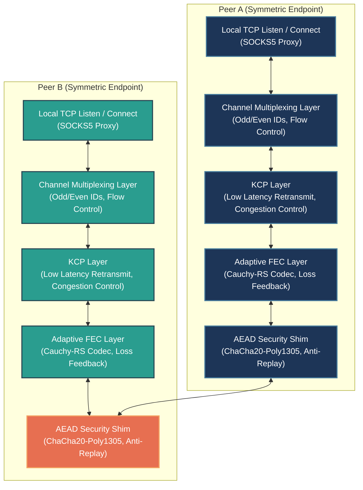

# BiTun (Bi-directional Tunnel)

[](../LICENSE)
[]()
[]()

**BiTun** is a lightweight, fully symmetric, point-to-point encrypted tunnel tool written in pure C. Operating over KCP and UDP, it provides high-performance duplex tunneling with robust NAT hole punching, connection migration, ChaCha20-Poly1305 AEAD encryption, and anti-replay protections.

Over a single encrypted UDP tunnel, BiTun supports bidirectional **Dynamic SOCKS5 Proxies** concurrently on both endpoints.

> 🌐 **Multi-language Documentation**:
> *   [Chinese Version (中文版)](../README.md)
> *   [Japanese Version (日本語版)](README.ja.md)
> *   [System Design Specification (design.md)](design.md) (Design details located at `/home/chenming/BiTun/docs/design.md`)
> *   [Verification & Testing Report (verification_report.md)](verification_report.md)

---

## 📐 System Architecture & Data Flow



### Traffic Flow Patterns (Traffic Flows)

#### Bidirectional SOCKS5 Proxy Mode


---

## 🚀 System Features

1. **Fully Symmetric Peer-to-Peer Architecture**
   * Both sides run identical code and state machines. There is no hardcoded Client/Server distinction.
   * Supports **Symmetric Active-Active Punching** and **Passive/Dynamic Learning** modes. In passive mode, a peer binds to the dynamic NAT mapping of the first valid incoming packet, enabling seamless point-to-point connections.
2. **KCP Reliability & Channel Multiplexing**
   * Integrates KCP over raw UDP, offering fast ARQ retransmission and low-latency transport.
   * Multiplexes multiple concurrent application connections over a single KCP tunnel. Employs Odd/Even Channel ID generation to prevent ID collisions.
3. **Adaptive Cauchy-RS FEC (Forward Error Correction)**
   * **High Performance FEC**: Employs Cauchy-Matrix Reed-Solomon coding over GF(256) to group and encode KCP packets (N data packets + R parity packets). Enables zero-retransmit packet recovery under high loss environments, significantly minimizing jitter and latency.
   * **Loss Estimation & Adaptive Feedback**: The receiver tracks expected vs received packets to calculate real-time loss rates, feeding it back to the sender via `CMD_FEC_FEEDBACK (0x07)` control frames. The sender dynamically scales the N and R coding ratio (resilient to >20% packet loss).
4. **Cryptographic Defenses (AEAD & Anti-Replay)**
   * **Full Traffic AEAD**: Integrates ChaCha20-Poly1305 between UDP and KCP to encrypt and authenticate all packet payloads and control frames.
   * **Session Key Derivation**: Uses PSK only for initial challenge-response. Derives ephemeral session keys using **HKDF-SHA256** based on mutual random salts, completely mitigating Nonce-reuse issues upon device restarts.
   * **Sliding Window Anti-Replay**: Employs an IPsec-style 64-bit sliding window bitmap on the receiver side to silently discard replayed packets, preventing CPU/memory exhaustion DoS attacks.
5. **Authenticated Fast Reconnection (AUTH_RESET)**
   * When a peer reboots, it transmits a plaintext `AUTH_RESET` frame signed using the PSK. The active peer validates the timestamp (±5s drift tolerance) and HMAC signature.
   * If verified, it tears down the stale connection in milliseconds, resolving the 30-second hang-up delay typical in AEAD filters.
6. **Seamless Connection Migration**
   * If a peer's public IP/Port changes due to a network switch (Wi-Fi/Cellular) or symmetric NAT port mapping changes, VPS dynamically updates the target address upon successful AEAD decryption of any incoming packet.
   * KCP session states, sliding windows, and TCP client channels remain active and uninterrupted.
7. **Granular Flow Control & Backpressure**
   * **Sender Backpressure**: Monitors KCP's wait queue (`waitsnd >= 32`) to suspend local TCP reading. Combined with a 2KB read quota per channel tick, this prevents heap exhaustion and OOM.
   * **Channel-level Sliding Windows**: Employs SSH/HTTP2-style flow control (4KB windows pushed by `CMD_WINDOW_UPDATE` frames) to isolate congestion, completely avoiding Head-of-Line (HOL) blocking.

---

## 📂 Directory Layout

```text
.
├── LICENSE             # Open source license (Apache 2.0)
├── Makefile            # Build script
├── README.md           # Chinese README
├── run_integration_test.sh # One-click integration test script
├── docs/               # Documentation directory
│   ├── README.en.md    # English README (This document)
│   ├── README.ja.md    # Japanese README
│   ├── design.md       # System Design Specification
│   ├── verification_report.md # Verification & Testing Report
│   ├── bitun_osal_design.md   # OSAL Design Specification
│   ├── final_osal_spec.md     # OSAL API Specification
│   ├── task_plan.md           # Project Task Plan
│   ├── dependence_analysis.md # Dependency Analysis Report
│   ├── adversarial_report.md  # Adversarial Testing Report
│   ├── audit_report.md        # Code Audit Report
│   ├── implementation_task_plan.md           # Implementation Task Plan
│   ├── implementation_submission.md          # Implementation Submission Notes
│   ├── implementation_adversarial_report.md  # Implementation Adversarial Report
│   └── implementation_audit_report.md        # Implementation Audit Report
└── src/                # Source code directory
    ├── bitun_osal.h    # Cross-platform OSAL interface
    ├── encrypt.c/h     # AEAD encryption, HKDF, anti-replay sliding window
    ├── fec.c/h         # Adaptive Cauchy-RS FEC encoder/decoder
    ├── ikcp.c/h        # Core KCP protocol
    ├── socks5.c/h      # Stateless streaming SOCKS5 parser
    ├── tunnel.c/h      # Symmetric tunnel state machine, events, multiplexing, backpressure
    └── linux/          # Linux platform implementation
        ├── main.c      # CLI entry and config parser
        ├── bitun_osal.c # Linux platform OSAL implementation
        ├── test_bitun_osal.c # OSAL unit test suite
        └── test_fec.c  # FEC unit test suite
```

---

## 🛠️ Compilation

### Prerequisites
* Linux Operating System
* GCC compiler & GNU Make
* OpenSSL development libraries (providing `libcrypto` for ChaCha20-Poly1305 and HMAC/HKDF)

### Build Command
Compile by running make in the root directory:
```bash
make
```
This generates the binary `bitun` in the root folder.

### Clean Command
```bash
make clean
```

---

## 🧪 Testing & Verification

### Compile & Run OSAL Unit Tests
In the project root directory, run the following commands to compile and execute the Operating System Abstraction Layer (OSAL) unit tests:
```bash
gcc -O2 -Wall -Wextra -pthread -Isrc -o test_bitun_osal src/linux/test_bitun_osal.c src/linux/bitun_osal.c -lcrypto -lpthread
./test_bitun_osal
rm test_bitun_osal
```

### Compile & Run FEC Unit Tests
In the project root directory, run the following commands to compile and execute the FEC unit tests:
```bash
gcc -O2 -Wall -Wextra -Isrc -o test_fec src/linux/test_fec.c src/fec.c
./test_fec
rm test_fec
```

### Run System Integration Tests
In the project root directory, run the following command to execute the one-click system integration test:
```bash
bash run_integration_test.sh
```

---

## 📖 Usage Instructions

### Command Line Syntax
```text
bitun -p <local_port> [-r <remote_ip:remote_port>] -k <psk> [--odd | --even]
```
* `-p, --port`: Local port to bind to. For simplicity, the program **binds this port to both TCP and UDP simultaneously**:
  * **TCP Port**: Used as the SOCKS5 proxy listener for local client connections.
  * **UDP Port**: Used for KCP encrypted tunnel communication (hole punching, handshakes, traffic).
* `-r, --remote`: Remote peer UDP endpoint (`IP:Port`). **Omit this parameter to run in passive dynamic learning mode**.
* `-k, --psk`: Pre-shared key (automatically padded or truncated to 32 bytes).
* `--odd` / `--even`: Configures the peer to generate Odd or Even Channel IDs to prevent collisions. One side must be odd and the other must be even.

---

### 💡 Application Scenarios

#### Scenario 1: Symmetric Bidirectional SOCKS5 Proxy (Double Process Simulation)
* **Peer A** (Binds port 9000, initiating connection to B, Odd IDs):
  ```bash
  ./bitun -p 9000 -r 127.0.0.1:9001 -k MySecretPSKKey123456789012345678 --odd
  ```
* **Peer B** (Binds port 9001, initiating connection to A, Even IDs):
  ```bash
  ./bitun -p 9001 -r 127.0.0.1:9000 -k MySecretPSKKey123456789012345678 --even
  ```
* *Test*:
  Both Peer A and Peer B will serve as SOCKS5 proxies simultaneously on TCP 9000 and TCP 9001. Configure your browser or curl to use either `127.0.0.1:9000` or `127.0.0.1:9001` as a SOCKS5 proxy to access services behind the other end.

#### Scenario 2: Active-Passive Hole Punching (VPS Hub & LAN Node)
* **VPS Side** (Passive end, binds port 9000, waiting for connection, dynamically learning the client NAT address):
  ```bash
  ./bitun -p 9000 -k MySecretPSKKey123456789012345678 --odd
  ```
* **LAN Side** (Active end, binds port 9001, actively punching to the public VPS):
  ```bash
  ./bitun -p 9001 -r <VPS_IP>:9000 -k MySecretPSKKey123456789012345678 --even
  ```

---

## 📄 License

This project is licensed under the [Apache License 2.0](../LICENSE).
