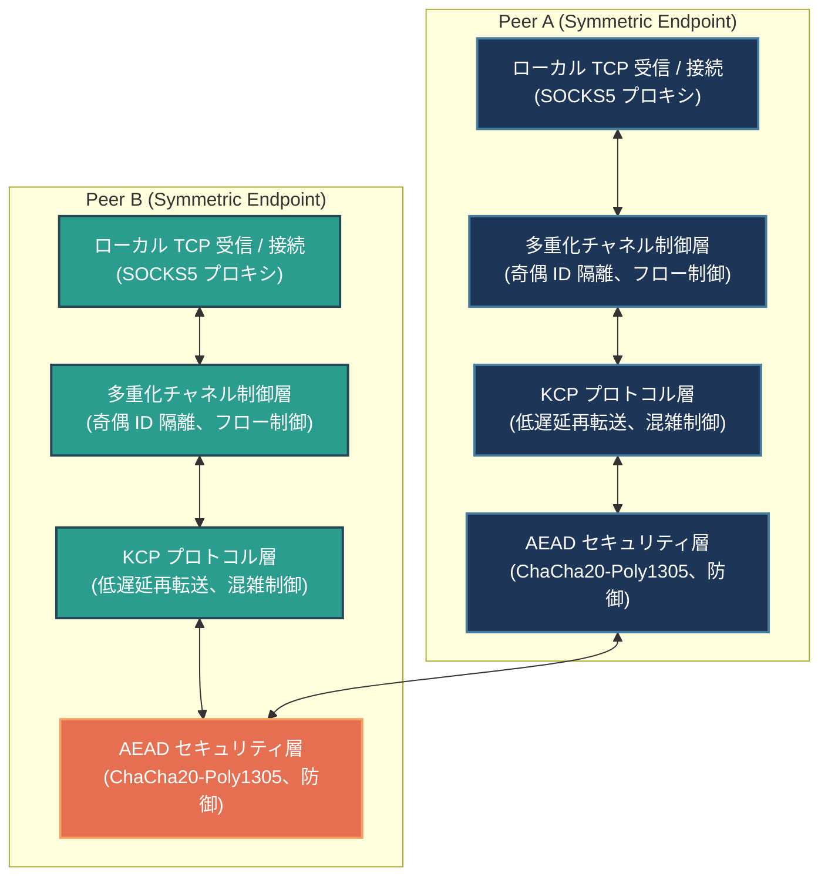

# BiTun (Bi-directional Tunnel)

[](../LICENSE)
[]()
[]()

**BiTun** は、純C言語で記述された、完全に対称的な（非対称な役割を持たない）KCPおよびUDPベースの双方向フルデュプレックス暗号化トンネルツールです。強力なホールパンチング、コネクションマイグレーション、ChaCha20-Poly1305 AEAD暗号化、およびリプレイ攻撃防御を統合しています。

単一の暗号化UDPトンネル上で、両端点において同時に双方向の**動的SOCKS5プロキシ**をサポートします。

> 🌐 **多言語ドキュメント / Multi-language Documentation**:
> *   [中国語版メインドキュメント (README.md)](../README.md)
> *   [英語版ドキュメント (README.en.md)](README.en.md)
> *   [システム設計仕様書 (design.md)](design.md) (設計詳細は `/home/chenming/BiTun/docs/design.md` にあります)
> *   [整合性およびテスト検証レポート (verification_report.md)](verification_report.md)

---

## 📐 システムアーキテクチャとデータフロー (System Architecture)



### データフローパターン (Traffic Flows)

#### 双方向 SOCKS5 プロキシモード


---

## 🚀 システムの特徴 (System Features)

1. **完全対称なピアツーピア（P2P）アーキテクチャ**
   * 両端で全く同じプログラムと状態マシンが動作し、従来のクライアント／サーバー（Client/Server）の役割区別がありません。
   * **双方向の対向ホールパンチング**と、相手のアドレスを自動で学習する**動的アドレス学習（Passive/Dynamic Learning）**モードをサポートします。
2. **KCP高信頼性転送とマルチプレクシング**
   * UDPの上にKCPプロトコルを統合し、低遅延で高速な再転送によるARQフロー制御を提供します。
   * 単一のKCP接続で複数チャネルを多重化（Multiplexing）します。競合を回避するため、奇数・偶数のチャネルID割り当て方式を採用しています。
3. **自律適応型 Cauchy-RS FEC 前方向誤り訂正**
   * **高性能エラー訂正**：有限体 GF(256) 上の Cauchy 行列 Reed-Solomon 符号を採用し、KCP パケットをグループ化して冗長符号化します（N データパケット + R 冗長パケット）。高損失ネットワーク環境でも再送なしでパケット復元を達成し、データジッターと遅延を大幅に削減します。
   * **損失率統計と適応型フィードバック**：受信側で期待パケット数と実際の受信数からリアルタイムの損失率を計算し、`CMD_FEC_FEEDBACK (0x07)` 制御フレームを介して送信側にフィードバックします。送信側はこれに基づいて N と R の符号化比率を動的に調整します（最高で >20% の深刻なパケット損失環境に対応可能）。
4. **高度なセキュリティ防護（AEADおよびリプレイ攻撃防御）**
   * **全トラフィックAEAD暗号化**：UDPとKCPの間にChaCha20-Poly1305によるセキュリティ層を配置し、すべてのデータおよび制御フレームを暗号化します。
   * **セッションキーの動的導出**：静的PSKは初期認証のみに使用されます。接続確立時に、双方のランダムソルトから **HKDF-SHA256** を使用して一時的な `Session_Key` を導出し、デバイス再起動時のNonce再利用脆弱性を完全に排除します。
   * **スライディングウィンドウによるリプレイ防御**：受信側にIPsecスタイルの64ビット幅リプレイ防御スライディングウィンドウを搭載し、重複したパケットを即座に破棄します。
5. **認証済み高速再接続 (AUTH_RESET)**
   * 片方のデバイスが予期せず再起動した際、静的PSKで署名された `AUTH_RESET`  フレームを送信します。もう一方はタイムスタンプ（±5秒の許容誤差）とHMAC署名を検証します。
   * 検証が成功すると、ミリ秒単位で古い接続とKCPインスタンスを破棄して再接続に応答し、30秒の接続ハングアップタイムアウトを回避します。
6. **シームレスなコネクションマイグレーション**
   * Wi-Fiからモバイル回線への切り替えや対称NATの動的ポート再マッピングによって、パブリックIP:Portが突然変化した場合でも、新しいパケットがAEAD復号に成功すれば、状態を保持したまま送信先アドレスを動的に更新します（TCP接続は維持されます）。
7. **細粒度なフロー制御とバックプレッシャー**
   * **送信側バックプレッシャー**：KCP送信キュー（`waitsnd >= 32`）を監視してローカルTCPの読み込み（`EPOLLIN`）を一時停止し、単一チャネルあたり1回最大2KBの読み込み制限と合わせ、メモリ枯渇（OOM）を防止します。
   * **チャネルレベルのスライディングウィンドウ**：SSH/HTTP2スタイルのフロー制御（`CMD_WINDOW_UPDATE`フレームで更新される4KBウィンドウ）をチャネルごとに維持し、遅い接続が他の正常な接続をブロックする**ヘッドオブラインブロッキング（HOL Blocking）**を解消します。

---

## 📂 ディレクトリ構成 (Directory Layout)

```text
.
├── LICENSE             # オープンソースライセンス (Apache 2.0)
├── Makefile            # ビルドスクリプト
├── README.md           # 中国語メイン README
├── run_integration_test.sh # 一括統合テストスクリプト
├── docs/               # ドキュメントディレクトリ
│   ├── README.en.md    # 英語 README
│   ├── README.ja.md    # 日本語 README (このドキュメント)
│   ├── design.md       # システム設計仕様書
│   ├── verification_report.md # 整合性およびテスト検証レポート
│   ├── bitun_osal_design.md   # OSAL設計仕様書
│   ├── final_osal_spec.md     # OSAL API規格書
│   ├── task_plan.md           # プロジェクトタスク計画書
│   ├── dependence_analysis.md # 依存性分析レポート
│   ├── adversarial_report.md  # 敵対的テストレポート
│   ├── audit_report.md        # コード監査レポート
│   ├── implementation_task_plan.md           # 実装タスク計画書
│   ├── implementation_submission.md          # 実装提出説明書
│   ├── implementation_adversarial_report.md  # 実装敵対的テストレポート
│   └── implementation_audit_report.md        # 実装監査レポート
└── src/                # ソースコードディレクトリ
    ├── bitun_osal.h    # 統一OS抽象化レイヤー（OSAL）インターフェース
    ├── encrypt.c/h     # AEAD暗号化、HKDF、リプレイ防御スライディングウィンドウ
    ├── ikcp.c/h        # KCPプロトコルコアコード
    ├── socks5.c/h      # ステートレスなストリーミングSOCKS5パーサー
    ├── tunnel.c/h      # 対称トンネル状態マシン、イベント、多重化、バックプレッシャー
    ├── main.c          # CLIエントリおよび設定パーサー
    └── linux/          # Linuxプラットフォーム実装
        ├── bitun_osal.c # Linux用OSAL実装
        └── test_bitun_osal.c # OSALユニットテストスイート
```

---

## 🛠️ コンパイル

### 前提条件
* Linux オペレーティングシステム
* GCC コンパイラおよび GNU Make
* OpenSSL 開発ライブラリ（ChaCha20-Poly1305およびHMAC/HKDF演算用の `libcrypto` が必要）

### ビルド方法
プロジェクトのルートディレクトリで以下を実行します：
```bash
make
```
ビルドが成功すると、ルートディレクトリに実行バイナリファイル `bitun` が生成されます。

### クリーンアップ
```bash
make clean
```

---

## 🧪 テストと検証

### OSALユニットテストのコンパイルと実行
プロジェクトのルートディレクトリで、以下のコマンドを実行してOS抽象化レイヤー（OSAL）のユニットテストをビルドおよび実行します：
```bash
gcc -O2 -Wall -Wextra -pthread -Isrc -o test_bitun_osal src/linux/test_bitun_osal.c src/linux/bitun_osal.c -lcrypto -lpthread
./test_bitun_osal
rm test_bitun_osal
```

### システム統合テストの実行
プロジェクトのルートディレクトリで、以下のコマンドを実行して一括統合テストを実行します：
```bash
bash run_integration_test.sh
```

---

## 📖 詳しい使用方法

### コマンドラインパラメータの構文
```text
bitun -p <local_port> [-r <remote_ip:remote_port>] -k <psk> [--odd | --even]
```
* `-p, --port`：ローカルバインドUDPポート。ローカル側でのSOCKS5 TCPリスニングポートも兼ねます。
* `-r, --remote`：対端のUDP通信アドレス（`IP:Port`）。**このパラメータを省略すると、本ノードはパッシブ監視／動的アドレス学習モードで動作します**。
* `-k, --psk`：事前共有鍵（PSK。自動的に32バイトにトリミングまたはパディングされます）。
* `--odd` / `--even`：チャネルIDを生成する際の奇数／偶数を指定します。競合を避けるため、一方はodd、もう一方はevenにする必要があります。

---

### 💡 典型的な接続シナリオ

#### シナリオ 1：双方向 SOCKS5 動的プロキシ（ローカルでの2プロセスシミュレーション）
* **Peer A** (UDP 9000番ポートでSOCKS5プロキシを起動し、Peer Bに向けてホールパンチを実行。奇数ID生成)：
  ```bash
  ./bitun -p 9000 -r 127.0.0.1:9001 -k MySecretPSKKey123456789012345678 --odd
  ```
* **Peer B** (UDP 9001番ポートでSOCKS5プロキシを起動し、Peer Aに向けてホールパンチを実行。偶数ID生成)：
  ```bash
  ./bitun -p 9001 -r 127.0.0.1:9000 -k MySecretPSKKey123456789012345678 --even
  ```
* *テスト方法*：
  Peer AとPeer Bが同時にSOCKS5プロキシとして機能します。ブラウザや curl コマンドのプロキシ先に `127.0.0.1:9000` または `127.0.0.1:9001` を指定してアクセスします。

#### シナリオ 2：アクティブ - パッシブ動的学習パンチング (公網サーバーと内網端末)
* **VPS側** (UDP 9000番ポートで待ち受け。クライアントの接続時のグローバルIP:Portを動的に学習してバインド)：
  ```bash
  ./bitun -p 9000 -k MySecretPSKKey123456789012345678 --odd
  ```
* **ローカル内網側** (UDP 9001番ポートで起動し、VPSのパブリックIPに向けて継続的にパンチングを実行)：
  ```bash
  ./bitun -p 9001 -r <VPS_IP>:9000 -k MySecretPSKKey123456789012345678 --even
  ```

---

## 📄 ライセンス

このプロジェクトは、[Apache License 2.0](../LICENSE)の条件に基づいて公開されています。
