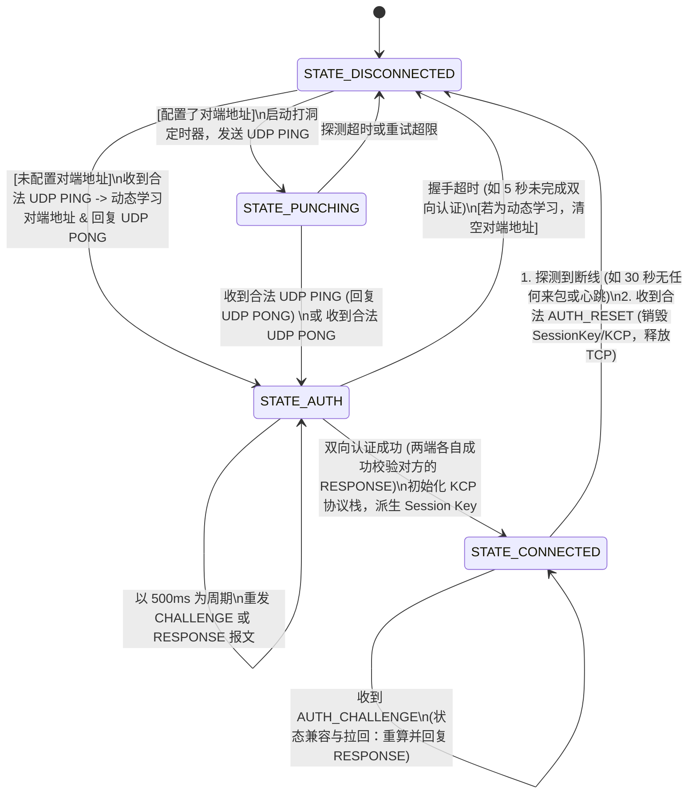
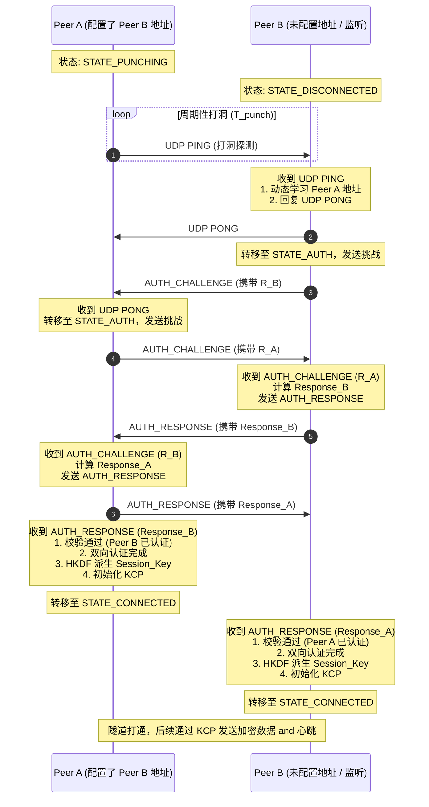
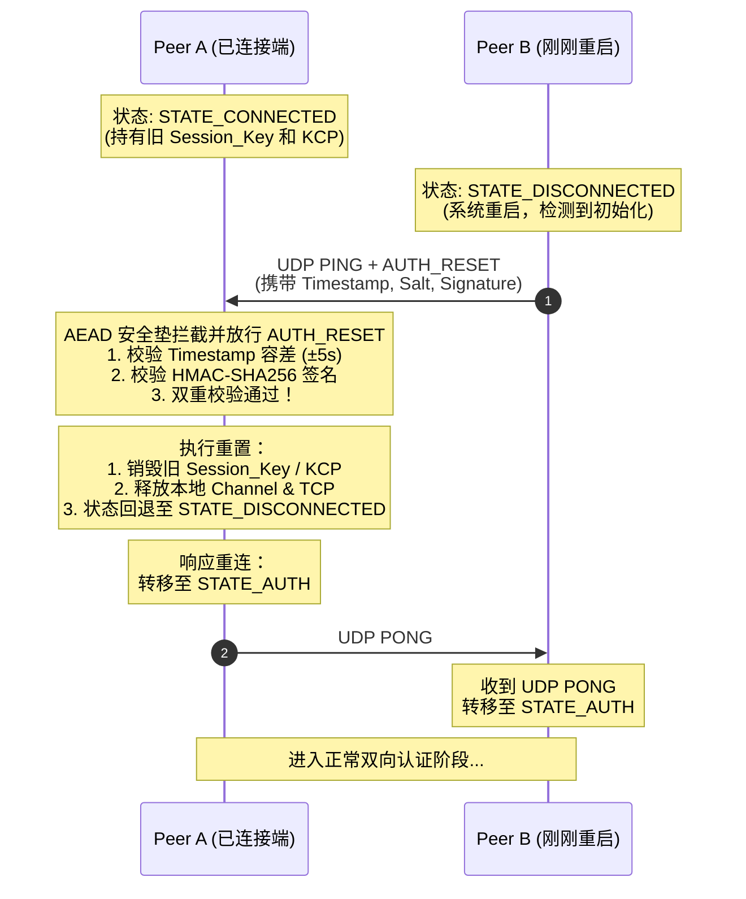
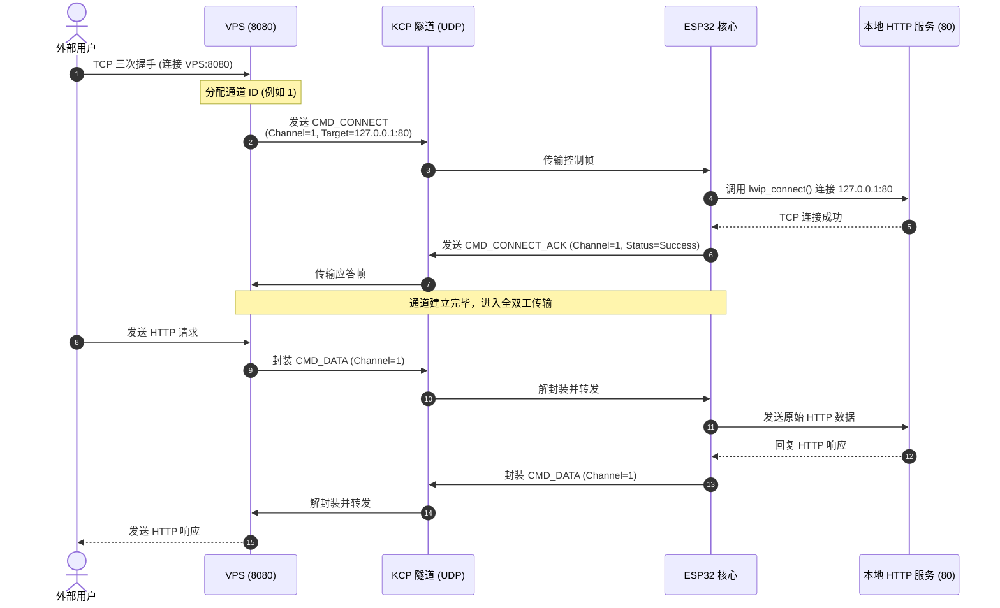
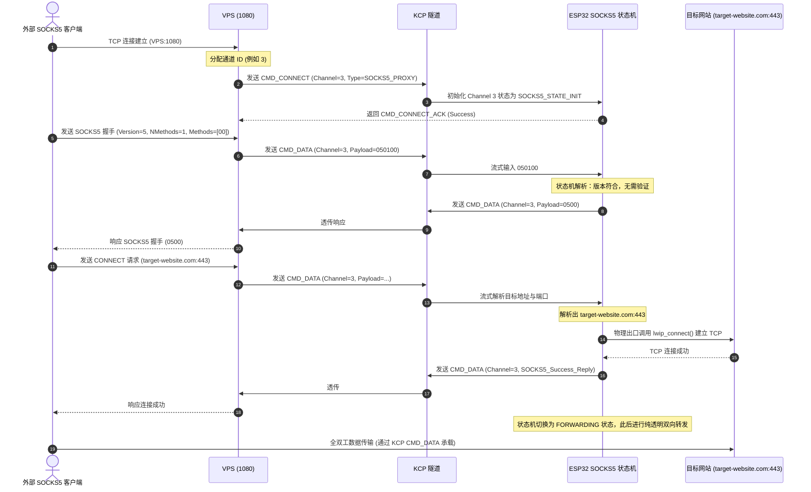
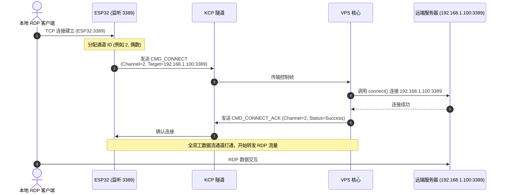
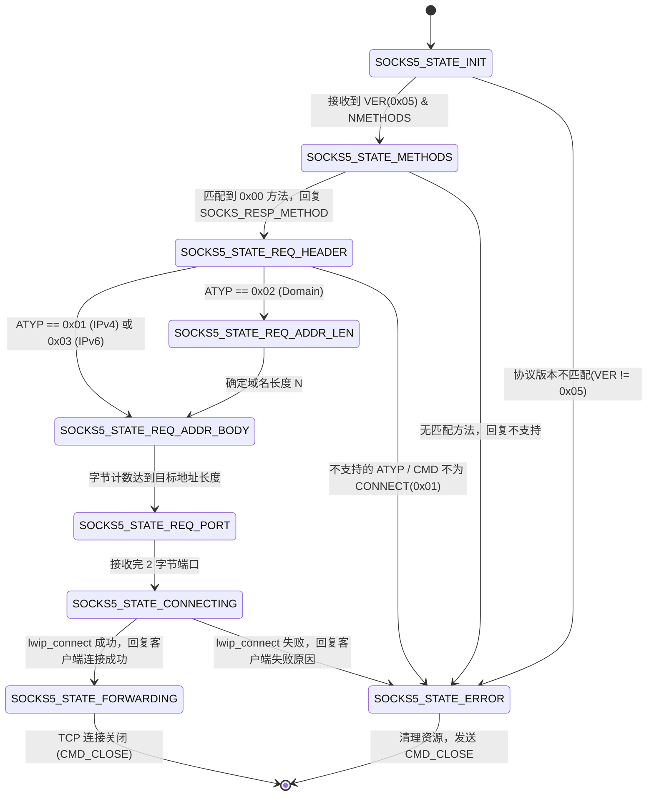

# 双向隧道系统设计说明书 (Bi-directional Tunnel Design Specification)

> **文档状态**：草稿 (Draft)  
> **版本**：v0.2  
> **主要设计者**：Agent B: 牛马 (The Builder)  
> **协议版本**：v1.1.0  

---

## 1. 概述与核心目标 (Overview & Core Objectives)

本双向隧道系统（BiTun）旨在解决位于 NAT/防火墙内部的嵌入式设备（如 ESP32 芯片组）与具有公网 IP 的虚拟专用服务器（VPS）之间的双向全双工通信问题。

系统需具备以下三大特性：
1. **中性角色与对称打洞**：不依赖特定的一方作为传统的“主动连接发起方”。采用对称打洞（Symmetric Hole Punching）技术，一旦任意一端发起 UDP 探测并得到应答，即在底层确立 UDP 传输信道。
2. **KCP 可靠传输集成**：在 UDP 之上运行 KCP 协议，提供低延迟、快速重传的流控与拥塞控制，适应弱网环境。
3. **多路复用与双向平移**：在单个 KCP 连接之上进行多路复用（Multiplexing），支持入站数据流平移（反向映射/动态代理）与出站数据流平移（正向映射/网关桥接）。

---

## 2. 隧道协议栈结构 (Protocol Stack Architecture)

双向隧道采用分层协议栈设计，如下图所示：

```
+------------------------------------------+
|          应用层流量 (TCP/SOCKS5)         |
+------------------------------------------+
|       Channel Multiplexing (分路控制层)   |
|   (封装 Channel ID, Cmd Type, Payload)   |
+------------------------------------------+
|          KCP 协议层 (可靠传输层)          |
|  (提供重传、拥塞控制、流控，通过 ikcp 实现) |
+------------------------------------------+
|          UDP 传输层 (UDP Socket)         |
+------------------------------------------+
|                 物理介质                  |
+------------------------------------------+
```

### 2.1 各层职责定义

*   **UDP 传输层**：底层的无连接数据报传输通道。负责发送与接收原始 UDP 包，是 NAT 打洞与保活的承载载体。
*   **KCP 协议层**：将不稳定的 UDP 包转换为可靠的字节流。通过合理的窗口调优（针对 ESP32 内存），提供快速重传和选择性确认（SACK），避免 TCP 的拥塞窗口剧烈抖动。
*   **分路控制层 (Channel Multiplexing)**：在可靠字节流上切片并进行多路复用。每个分路（Channel）映射一个应用层 TCP 连接。通过帧头中的 `Channel ID` 进行流量的分流与合流。
*   **应用层**：包含普通的 TCP 透传流与 SOCKS5 代理流。

---

## 3. 控制帧与数据帧格式 (Multiplexing Frame Format)

在 KCP 字节流之上，数据以“分路控制帧”为基本单位进行传输。为了在 ESP32 上实现最高效的解析，帧格式设计极其紧凑，且采用网络字节序（大端序，Big-Endian）。

### 3.1 帧布局

```
 0                   1                   2                   3
 0 1 2 3 4 5 6 7 8 9 0 1 2 3 4 5 6 7 8 9 0 1 2 3 4 5 6 7 8 9 0 1
+-+-+-+-+-+-+-+-+-+-+-+-+-+-+-+-+-+-+-+-+-+-+-+-+-+-+-+-+-+-+-+-+
|                           Channel ID                          |
+-+-+-+-+-+-+-+-+-+-+-+-+-+-+-+-+-+-+-+-+-+-+-+-+-+-+-+-+-+-+-+-+
|    Cmd Type   | Reserved/Flags|         Payload Length        |
+-+-+-+-+-+-+-+-+-+-+-+-+-+-+-+-+-+-+-+-+-+-+-+-+-+-+-+-+-+-+-+-+
|                                                               |
~                            Payload                            ~
|                                                               |
+-+-+-+-+-+-+-+-+-+-+-+-+-+-+-+-+-+-+-+-+-+-+-+-+-+-+-+-+-+-+-+-+
```

### 3.2 字段说明

| 字段名 | 长度 (字节) | 类型 | 说明 |
| :--- | :--- | :--- | :--- |
| **Channel ID** | 4 | uint32_t | 通道唯一标识符，用于多路复用。为避免冲突：<br> - 由 **VPS 主动发起**的通道，使用**奇数** ID (1, 3, 5...)；<br> - 由 **ESP32 主动发起**的通道，使用**偶数** ID (2, 4, 6...)。 |
| **Cmd Type** | 1 | uint8_t | 命令类型字。详细定义见 3.3 节。 |
| **Reserved/Flags** | 1 | uint8_t | 保留或特定命令的标志位。目前默认为 `0x00`。 |
| **Payload Length** | 2 | uint16_t | 载荷长度，取值范围 `0 ~ 65535` |
| **Payload** | 变长 | uint8_t[] | 数据载荷。长度由 `Payload Length` 指定。 |

### 3.3 命令类型 (Cmd Type) 定义

*   **`0x01` (CMD_CONNECT)**：连接建立请求。
    *   *Payload 结构*：
        *   `Addr Type` (1 字节): `0x01` (IPv4), `0x02` (Domain Name), `0x03` (IPv6), `0x04` (SOCKS5 代理激活 - 针对场景2)。
        *   `Port` (2 字节): 目标端口。
        *   `Address` (变长):
            *   若为 IPv4：4 字节 IP 地址。
            *   若为 Domain Name：1 字节域名长度 + 变长域名字符串。
            *   若为 IPv6：16 字节 IP 地址。
            *   若为 SOCKS5 代理激活：Payload 长度为 0，告知 ESP32 该通道应启动无栈 SOCKS5 状态机。
*   **`0x02` (CMD_CONNECT_ACK)**：连接建立应答。
    *   *Payload 结构*：1 字节状态码 (`0x00` 成功，其他值为错误码如 `0x01` 目标不可达，`0x02` 超时等)。
*   **`0x03` (CMD_DATA)**：数据传输帧。
    *   *Payload 结构*：原始应用层 TCP 流数据。
*   **`0x04` (CMD_CLOSE)**：通道释放通知。
    *   *Payload 结构*：1 字节原因码。发送后，两端释放该 `Channel ID` 对应的系统资源。
*   **`0x05` (CMD_KEEPALIVE)**：心跳保活帧。
    *   *Payload 结构*：无（Payload Length 为 0）。用于维持 UDP NAT 映射以及应用层活跃状态。
*   **`0x06` (CMD_WINDOW_UPDATE)**：通道级窗口更新帧。
    *   *Payload 结构*：4 字节窗口增量值（uint32_t，网络字节序），表示接收端已消费并释放的缓冲区大小，用于增加发送端的可用发送窗口。

---

## 4. 对称打洞与连接维护 (Symmetric Hole Punching & Connection Management)

在两端没有 STUN/TURN 服务器辅助、且可能均处于 NAT/防火墙内侧的情况下，系统采用完全对称的对等端（Peer-to-Peer）对称打洞与握手状态机设计，以解决 UDP 双向连通性与连接的稳健维持。

### 4.1 对等角色与动态学习 (Peer Roles & Dynamic Learning)

系统不区分传统的主从角色（如 Client/Server 或 Initiator/Listener），两端运行完全相同的协议栈和状态机。两端对对端地址的配置分为以下两种模式：

1.  **静态/主动探测模式 (Static/Active Punching)**：
    *   若本端配置了合法的对端公网 IP:Port，则在启动后会主动发送 UDP PING 探测包，同时也监听本地端口。
2.  **动态学习/监听模式 (Passive/Dynamic Learning)**：
    *   若本端未配置对端地址（或配置为 `0.0.0.0:0`），则它将不主动发起探测，仅作为监听方等待接收数据包。
    *   一旦收到合法的 UDP 包，则本端将从 UDP 数据报头部**直接捕获并学习**对端的反射 IP:Port，并将其记录为对端的实际目标地址，供后续响应和数据流发送使用。

> [!WARNING]
> **双被动死锁防御限制**：
> 两端不能同时部署为动态学习模式（Passive Mode）。必须至少有一端配置了明确的对端公网 IP 与端口（Active Mode）以作为主动打洞的发起源。
> 为了彻底杜绝“双被动”配置导致的死锁，系统在初始化阶段增加了硬性系统检测：若检测到两端配置均为被动模式（即均未配置对端 IP:Port 或均设为 `0.0.0.0:0`），应打印错误日志并阻止建立连接，强行终止初始化流程。

通过这种对称设计，系统既支持两端都配置对端地址的“双向对称打洞”（以应对恶劣的对称 NAT 环境），也支持一端固定公网 IP 而另一端动态学习的“单向打洞与捕获”模式。

### 4.2 对称打洞握手状态机 (Symmetric Punching & Handshake State Machine)

两端均运行相同的状态机，定义了四个核心状态：`STATE_DISCONNECTED`、`STATE_PUNCHING`、`STATE_AUTH`、`STATE_CONNECTED`。

#### 4.2.1 状态定义与迁移逻辑



1.  **`STATE_DISCONNECTED` (未连接状态)**：
    *   *触发与行为*：若本端配置了明确的对端地址，则启动打洞定时器，开始以周期 $T_{punch}$ (默认 1 秒) 向对端发送 UDP PING 报文，并迁移至 `STATE_PUNCHING`。
    *   *监听行为*：若未配置对端地址，则本端停留在当前状态，持续监听本地 UDP 端口。
    *   *迁移条件*：若在监听中收到合法的 UDP PING 报文，本端从数据报头中捕获对端的反射 IP:Port 并记录为目标地址，同时回复 UDP PONG 报文，随后转移至 `STATE_AUTH`。
2.  **`STATE_PUNCHING` (打洞探测状态)**：
    *   *触发与行为*：以周期 $T_{punch}$ 持续向对端发送 UDP PING。此举会在本端 NAT 设备上建立对应的 UDP 映射表项。
    *   *迁移条件 1 (收到 PING)*：收到对端发送的合法 UDP PING 报文。若本端对端地址此前为动态学习且发生变化（或正在学习），则在此处更新目标地址，并立即向对端发送 UDP PONG，随后转移至 `STATE_AUTH`。
    *   *迁移条件 2 (收到 PONG)*：收到对端回复的合法 UDP PONG 报文。表明单向或双向物理通路已通，直接转移至 `STATE_AUTH`。
    *   *超时回退*：若打洞超时（例如持续 15 秒未收到任何应答），则回退至 `STATE_DISCONNECTED`。若对端是动态学习到的，则清空对端地址。
3.  **`STATE_AUTH` (身份认证状态)**：
    *   *触发与行为*：一旦进入该状态，本端立即生成一个 32 字节的强随机数 $R_{local}$，并向对端发送 `AUTH_CHALLENGE` 报文（携带 $R_{local}$），同时启动一个 5 秒的握手定时器。
    *   *握手重发机制*：为了对抗单次 UDP 丢包造成的握手中断，本端在进入 `STATE_AUTH` 状态后，以 500ms 为周期重发当前的 `AUTH_CHALLENGE` 报文；在收到对端的挑战并计算出对应的响应后，本端也以 500ms 为周期重发 `AUTH_RESPONSE` 报文，直到成功收到并校验对端的 `AUTH_RESPONSE`（或握手超时）。
    *   *处理对端挑战*：当收到对端发送的 `AUTH_CHALLENGE` 报文（携带对端生成的随机数 $R_{remote}$）后，本端计算对对端的挑战响应：
        $$Response_{local} = HMAC\_SHA256_{PSK}(R_{local} \ || \ R_{remote} \ || \ \text{"BiTun Handshake Challenge"})$$
        并向对端发送 `AUTH_RESPONSE` 报文（携带 $Response_{local}$）。
    *   *校验对端响应*：当收到对端发送的 `AUTH_RESPONSE` 报文（携带 $Response_{remote}$）时，本端在本地计算期望的响应值：
        $$Expected\_Response = HMAC\_SHA256_{PSK}(R_{remote} \ || \ R_{local} \ || \ \text{"BiTun Handshake Challenge"})$$
        比对 $Response_{remote}$ 与 $Expected\_Response$，若完全一致，则本端将对端标记为“已认证成功”。
    *   *迁移条件 (连接成功)*：当本端已成功发送自己的 `AUTH_RESPONSE` 且成功校验了对端的 `AUTH_RESPONSE` 后（双向认证闭环），双方基于双方的随机数派生会话密钥并初始化 KCP：
        -   *Salt 构造*：通过 `memcmp(R_local, R_remote, 32)` 比较两个随机数的大小，将大者拼在前面，小者拼在后面，确保两端构造出的 Salt 绝对一致。
        -   *密钥派生*：
            $$PRK = HKDF\_Extract(Salt = R_{high} \ || \ R_{low}, IKM = PSK)$$
            $$Session\_Key = HKDF\_Expand(PRK, Info = \text{"BiTun Ephemeral Key"}, L = 32)$$
        -   *初始化与转移*：初始化底层 KCP 协议栈与 AEAD 安全垫，将当前状态转移至 `STATE_CONNECTED`。
    *   *状态兼容与拉回机制*：如果本端（Peer A）已进入 `STATE_CONNECTED`，但在该状态下又收到了对端（Peer B）发来的 `AUTH_CHALLENGE` 报文（表明 B 的握手未同步，仍处于 `STATE_AUTH` 状态并在重发挑战），本端不能丢弃此包。本端必须立刻使用静态 PSK 重新计算并向 B 回复对应的 `AUTH_RESPONSE` 报文，以协助 B 顺利迁入 `STATE_CONNECTED` 状态，彻底避免半连接卡线。
    *   *超时回退*：若 5 秒握手定时器超时仍未完成双向认证，本端立即清空握手上下文，回退至 `STATE_DISCONNECTED`。若对端是动态学习到的，则清空对端地址。
4.  **`STATE_CONNECTED` (隧道建立状态)**：
    *   *触发与行为*：在该状态下，底层的 UDP 报文由 `Session_Key` 保护的 ChaCha20-Poly1305 AEAD 加密，且通过 KCP 进行流控、重传与可靠交付。
    *   *心跳维持*：两端在此状态下通过 KCP 连接定期（例如 10 秒）发送 `CMD_KEEPALIVE`。
    *   *超时检测与快速重置*：
        -   **自然超时**：若本端在 $T_{timeout}$（默认 30 秒）内未收到任何数据帧或心跳帧，判定连接超时断开。销毁 KCP 实例，所有现存的 `Channel` 均触发本地 TCP 关闭，清空会话密钥，状态回退至 `STATE_DISCONNECTED`。
        -   **快速重置**：在此状态下，若收到对端发送的合法明文 `AUTH_RESET` 报文且通过安全校验（详见 4.3 节），本端应立即销毁旧的会话密钥与 KCP 实例，释放所有 TCP 资源，状态退回 `STATE_DISCONNECTED`，从而快速响应对端的重连请求。
    *   *重置回退后的处理*：状态回退至 `STATE_DISCONNECTED` 后，若对端地址是动态学习到的，清空该地址，等待新的包来重新学习；若配置了对端地址，则重新启动打洞探测。

#### 4.2.2 对称打洞与双向握手时序图

以下是 Peer A（主动探测）与 Peer B（未配置地址，动态学习）建立连接的对称打洞时序图：



### 4.3 快速重连与安全重置机制 (Fast Reconnection & Authenticated Reset)

为解决对端突然重启后，已连接端（Peer A）由于 AEAD 安全垫拦截了明文重连报文、导致必须等待 30 秒超时释放后才能重连的缺陷，系统引入了**带安全凭证的快速重置帧 (Authenticated Reset Frame / AUTH_RESET)**。

#### 4.3.1 AUTH_RESET 帧格式

重启后的 Peer B 若检测到自身刚完成系统重启，发送的打洞/重连报文不仅包含明文 `UDP PING`，还必须附加一个 `AUTH_RESET` 帧。`AUTH_RESET` 帧为明文传输（因为此时尚未派生 Session_Key），其具体字段格式如下（均使用网络字节序/大端序）：

| 字段名 | 长度 (字节) | 类型 | 说明 |
| :--- | :--- | :--- | :--- |
| **Timestamp** | 8 | uint64_t | 毫秒级系统时间戳，用于防重放校验。 |
| **Random_Salt** | 8 | uint64_t | 随机盐，用于防止重放攻击。 |
| **Signature** | 32 | uint8_t[] | HMAC-SHA256 签名，利用静态预共享密钥 PSK 对二进制数据 `Timestamp \|\| Random_Salt \|\| "BiTun Reset Request"` 进行计算。 |

#### 4.3.2 已连接端的安全重置处理

当 Peer A 处于 `STATE_CONNECTED` 状态并收到来自对端 IP:Port 目标的明文 `AUTH_RESET` 包时，AEAD 安全垫应当拦截并**临时放行**此包，利用静态 PSK 计算并校验其 HMAC 签名。

为了防止攻击者截获旧的 `AUTH_RESET` 帧进行重放攻击，系统强制使用时间戳和单调性校验的**双重防重放机制**：
1.  **时间戳偏斜窗口校验**：校验收到的 `Timestamp` （毫秒）是否与本端当前时间差在合理容差内（例如 ±5 秒）。若超出此窗口，则判定包无效直接丢弃。
2.  **时间戳与盐的绝对单调校验**：在隧道上下文结构中，维护 `last_reset_timestamp` 与 `last_reset_salt` 两个状态值。当接收到合法的 `AUTH_RESET`时，要求当前时间戳 `rst_time >= last_reset_timestamp`；若 `rst_time == last_reset_timestamp`，则要求随机盐 `rst_salt != last_reset_salt`。若当前时间戳落后或盐重复，立即判定为重放包，静默丢弃。
3.  **HMAC 签名校验**：利用静态预共享密钥 PSK 对接收到的 `Timestamp \|\| Random_Salt \|\| "BiTun Reset Request"` 重新计算 HMAC-SHA256 签名，并使用恒定时间内存比较 `const_memcmp` 与帧中的 `Signature` 对比。若校验通过，更新 `last_reset_timestamp = rst_time` 和 `last_reset_salt = rst_salt`，然后进行重置。

#### 4.3.3 状态重置与快速迁移

如果上述双重校验均通过，表明对端确实发生了重启并正在发出合法重连。Peer A 必须立即执行以下重置动作：
1.  立即销毁当前的 `Session_Key` 与旧的 KCP 实例。
2.  通知本地 Channel 模块进行所有 TCP 资源的释放。
3.  将当前状态退回 `STATE_DISCONNECTED`。
4.  响应对端的握手重连（向其发送 UDP PONG，并进入 `STATE_AUTH` 响应其重发挑战）。

通过此机制，可以将原本 30 秒的静默重连延迟降至毫秒级，同时保证了传输通道的安全性，防御了伪造重置报文引发的拒绝服务（DoS）攻击。

#### 4.3.4 快速重置与重连时序图

以下是 Peer B 重启后触发 Peer A 快速重置并重新建立连接的时序图：



### 4.4 对称连接迁移机制 (Symmetric Connection Migration)

在移动网络切换、WiFi 与蜂窝网络交替或 NAT 端口动态重映射等环境下，本端或对端的反射 IP:Port 可能会发生突变。为了保证可靠字节流传输的连续性，系统设计了对称的连接迁移机制：

1.  **数据解密校验**：当本端收到一个来自非当前记录对端 IP:Port 目标的 UDP 数据包时，不会直接丢弃。本端首先尝试将该报文送入 AEAD 安全垫中，使用当前合法的 `Session Key`进行解密和完整性校验。
2.  **目标地址热更新**：若该报文能够被成功解密并验证（证明发送方持有当前连接合法且唯一的临时会话密钥 `Session Key`），则本端判定对端发生了网络迁移。本端将在底层无缝且动态地将对端的目标 IP:Port 更新为新捕获的 IP:Port。
3.  **连接无缝保持**：在整个地址更新过程中，底层的 KCP 实例与上层分路控制层（Channel Multiplexing）状态均保持不变，未确认数据包无需重传，TCP 流量无需中断，保证了网络变动下的零感平滑过渡。

## 5. 四大核心场景数据流与时序 (Core Scenarios)

### 5.1 第一向：入站数据流平移

#### 场景 1：静态固定端口反向映射（单点入站）
*   **目标**：公网访问 `VPS:8080`，流量平移至 `ESP32 本地 127.0.0.1:80`。



#### 场景 2：动态多目标请求代理（动态入站调度）
*   **目标**：外部连接 `VPS:1080` (SOCKS5 代理端口)，ESP32 的无栈 SOCKS5 状态机流式解析目标并调用 `lwip_connect()`。



---

### 5.2 第二向：出站数据流平移

#### 场景 3：本地静态端口正向映射（单点出站）
*   **目标**：本地设备连接 `ESP32:3389`，流量转发至 `VPS 所在的远端私有服务 192.168.1.100:3389`。



#### 场景 4：跨网络局域网三层拓扑桥接（全网段出站透传）
*   **目标**：本地用户连接 `ESP32:8888`，平移映射至远端局域网网关 `192.168.1.1:80`。

场景 4 在协议层设计上与场景 3 完全一致。它们的核心区别在于部署拓扑：
- 场景 3 是单点到单点的正向映射。
- 场景 4 的目标地址是远端私有局域网网关（或通过路由导向整个子网）。
- 从分路控制帧的角度看，ESP32 仍然向 VPS 发送 `CMD_CONNECT (Channel ID=2n, Target=192.168.1.1:80)`，VPS 收到后利用本地路由或网卡发送 TCP 握手。

---

## 6. ESP32 无栈 SOCKS5 状态机 (ESP32 Stateless SOCKS5 State Machine)

为降低 ESP32 的内存消耗，避免为每个通道分配大缓冲区存储 SOCKS5 握手帧，设计了**流式无栈状态机**。该状态机每次只处理输入的单个或多个字节，通过状态迁移即时处理，并直接向物理网络或 KCP 发送响应。

### 6.1 状态定义

1.  `SOCKS5_STATE_INIT`：等待客户端的版本和方法数信息。
2.  `SOCKS5_STATE_METHODS`：流式接收并匹配方法列表（寻找 `0x00` 无密码方法）。
3.  `SOCKS5_STATE_REQ_HEADER`：等待请求报头（VER, CMD, RSV, ATYP）。
4.  `SOCKS5_STATE_REQ_ADDR_LEN`：读取域名长度（仅当 ATYP 为 Domain Name 时）。
5.  `SOCKS5_STATE_REQ_ADDR_BODY`：流式读取地址字节（IPv4 为 4字节，IPv6 为 16字节，域名为变长）。
6.  `SOCKS5_STATE_REQ_PORT`：读取端口号（2 字节）。
7.  `SOCKS5_STATE_CONNECTING`：启动 `lwip_connect` 异步发起连接，暂停接收数据。
8.  `SOCKS5_STATE_FORWARDING`：已连接，后续数据做纯透明双向透传。
9.  `SOCKS5_STATE_ERROR`：错误状态，释放通道。

### 6.2 状态转移图 (State Transition Diagram)



### 6.3 关键流式解析设计细节

### 6.3 关键流式解析设计细节

*   **动态安全域名解析与自管道（Self-Pipe）异步 DNS 机制**：
    为了消除内存泄露与 Use-After-Free (UAF) 风险，状态机在解析 SOCKS5 的域名类型（ATYP = 0x02）时：
    1.  **读取域名长度**：读取域名长度 $N$（1字节）。
    2.  **安全动态分配**：立即在堆上动态分配一段长度为 `N + 1` 字节的内存缓冲区（即 `char *domain = (char *)malloc(N + 1);`）。如果分配失败，则立即转入 `SOCKS5_STATE_ERROR` 并释放通道。
    3.  **流式接收与终结符拼接**：流式接收接下来的 $N$ 字节域名内容并写入该缓冲区，最后在域名末尾强制拼接 `\0` 形成合法的 C 风格字符串。
    4.  **无竞态自管道（Self-Pipe）架构**：
        系统在初始化时创建了一对自管道 `dns_pipe_fd[2]` 并将读端 `dns_pipe_fd[0]` 注册至主 Epoll 反应器中。为了使 DNS 解析完全不阻塞主事件循环，主进程为每个 DNS 域名请求在后台启动一个独立的 DNS 解析线程：
        -   **线程安全控制块**：
            ```c
            typedef struct {
                char *domain;            // 动态分配的域名
                uint32_t channel_id;     // 关联的通道 ID
                tunnel_t *tun;           // 指向隧道上下文的指针 (可能置为 NULL)
                pthread_t thread;        // 线程 ID
                struct sockaddr_in resolved_addr; // 解析出的 IP
                int success;             // 是否解析成功
                int done;                // 是否完成
            } DNS_RequestContext;
            ```
        -   **解耦式管道通知**：解析线程调用阻塞式 `getaddrinfo` 获取 IP。执行成功后，锁住全局 `dns_mutex`；若 `ctx->tun != NULL`（表明隧道未被销毁且通道存活），构造结构紧凑的 `dns_result_t` 并写入自管道写端 `dns_pipe_fd[1]`。
        -   **线程自主生命周期控制（杜绝 UAF 与内存泄露）**：在解锁 `dns_mutex` 后，由**该解析线程自身**负责 `free(ctx->domain)` 和 `free(ctx)` 释放上下文内存。主事件循环和主线程绝对不在外部访问或释放该 `ctx`。这保证了即使主线程提前关闭通道或重置隧道，后台线程也能平滑运行完毕并彻底自销毁，彻底根成了 UAF 与 Double Free 隐患。
        -   **通道生命周期断开关联**：在 `reset_tunnel` 或是 `close_channel` 时，主线程获取 `dns_mutex`，并将全局 `active_dns_reqs` 列表中对应通道索引的 `active_dns_reqs[idx]->tun` 设为 `NULL`，直接剥离隧道指针并从全局列表中置空。此时，当后台解析线程执行完毕并获得锁时，通过检测 `ctx->tun == NULL` 获知原通道已关，直接自销毁资源退出，安全退场。
        -   **管道消息处理**：当 Epoll 检测到 `dns_pipe_fd[0]` 可读时，主事件循环循环读取所有 `dns_result_t` 结构体，根据 `channel_id` 匹配当前活跃的 `channels`，发起非阻塞式 TCP `connect`；对于不存在的 `channel_id`，静默忽略，逻辑完全实现闭环。
*   **DNS 队列并发优化与 ERR_INPROGRESS 处理**：
    在高并发场景下，LwIP 默认的 DNS 请求队列容易积压导致阻塞或丢弃连接。系统进行如下优化：
    1. **宏参数调优**：在 `lwipopts.h` 中，将 `DNS_MAX_REQUESTS` 宏调大（例如从默认的 4 调整为 16 或更高），以容纳更多并发 DNS 请求。
    2. **ERR_INPROGRESS 状态处理**：当调用 `dns_gethostbyname` 返回 `ERR_INPROGRESS` 时，表明当前解析正在进行中（尚未命中本地缓存）。SOCKS5 状态机**不应直接关闭通道**，而是保持当前通道状态，注册 DNS 回调函数（`dns_found_callback`），进入异步等待队列。在回调触发前，通道暂停接收进一步的数据，待解析完成触发回调后再继续向下执行 TCP 连接流程。
*   **非阻塞/异步 `lwip_connect` 集成**：
    在 ESP32 中，为防止 SOCKS5 状态机阻塞整个系统的任务调度，当进入 `SOCKS5_STATE_CONNECTING` 状态时：
    1. 使用 `netconn` 接口的非阻塞模式，或注册 LwIP raw API 的 `tcp_connect` 回调函数。
    2. 当底层 TCP 完成握手后，触发连接回调函数，状态机接收到事件，向 KCP 写入 `CMD_DATA (SOCKS5_Success_Reply)`，并将通道状态迁移至 `SOCKS5_STATE_FORWARDING`。

---

## 7. 嵌入式资源优化与参数调优 (ESP32 Optimization)

由于 ESP32 的 SRAM (尤其是可自由支配的 Heap) 相对稀缺，必须对底层的 KCP 协议栈与分路缓存进行深度限制：

### 7.1 KCP 核心参数优化

*   **窗口大小 (Window Size)**：设置 `ikcp_wndsize(kcp, 32, 32)`。将发送与接收窗口均限制为 32 个报文包。这使得单个 KCP 实例最大占用的内存控制在数十 KB 内。
*   **最大传输单元 (MTU)**：设置 `ikcp_setmtu(kcp, 1400)`。防止经过 NAT 网关时发生 IP 分片，提高在复杂蜂窝或 Wi-Fi网络下的到达率。
*   **无延迟模式 (NoDelay)**：设置 `ikcp_nodelay(kcp, 1, 20, 2, 1)`。
    *   `nodelay=1`：开启极速模式。
    *   `interval=20`：内部时钟驱动为 20ms。
    *   `resend=2`：快速重传设定为 2 次 ACK 触发。
    *   `nc=1`：关闭拥塞控制。在嵌入式单通道场景下，关闭拥塞控制可获得更稳定的低延时表现。

### 7.2 流量控制与背压机制 (Flow Control & Backpressure)

为了在极低内存开销下防止 ESP32 发生 OOM，并避免多路复用下的队头阻塞（HOL Blocking），系统在分路控制层引入了发送侧背压限制与通道级滑动窗口流量控制。

#### 7.2.1 发送侧背压限制与全局配额控制 (Preventing Send Queue OOM)
*   **现象与风险**：在多路复用网络中，多个 Channel 并发活跃。如果各通道独立且不受控地向底层单个 KCP 实例写入数据，当底层 KCP 队列积压时，若单纯依靠修改 Epoll 监听事件来挂起/恢复，可能在高并发的边缘触发（Edge Triggered）模式下导致“挂起后唤醒失效”或在数据洪峰下遭遇死锁。
*   **基于 `read_suspended` 挂起标志与 Epoll 激活机制**：
    为了在不修改 Epoll 原始事件集合的同时，从根本上解决背压造成的死锁或漏读，系统采用了 `read_suspended` 挂起标志与主动唤醒结合的机制：
    1.  **通道级挂起状态位**：在 `channel_t` 结构体中引入 `int read_suspended;` 状态标记。
    2.  **零 Epoll 修改的背压挂起**：当检测到 `ikcp_waitsnd(tun->kcp) >= BACKPRESSURE_THRES`（默认 32 包发包限制）时，系统**绝不修改 Epoll 监听事件**（保持对 TCP Socket 的 `EPOLLIN | EPOLLET` 监听），而是将所有当前活动通道的 `read_suspended` 设为 `1`。在 Epoll 的事件循环中，如果某个通道触发了 `EPOLLIN`，但 `read_suspended` 为真，则直接跳过读取。这有效避免了由于修改 Epoll 状态带来的性能损耗与死锁隐患。
    3.  **单通道单次读取配额限制**：限制单个通道在单次被调度时，从其关联的本地 TCP Socket 读取的最大字节数（**默认限制为每次最多读取 2KB**）。这样，即使所有通道在同一时钟周期内全部被唤醒，单通道单次产生的 KCP 数据包数量也处于极低的受控状态（不超过 2 个 MTU 级别的数据包），配合全局调度器的即时校验，可以确保在任何时刻写入的 KCP 包总数都绝对处于安全阈值内，不会产生瞬时内存洪峰。
    4.  **背压恢复与主动 Epoll 唤醒**：在主事件循环 tick 中，如果检测到 `ikcp_waitsnd(tun->kcp) < BACKPRESSURE_THRES / 2`（恢复水位），并且存在被挂起的通道：
        - 将这些通道的 `read_suspended` 重置为 `0`。
        - 针对这些通道的 `tcp_fd` 主动调用一次 `epoll_ctl(tun->epoll_fd, EPOLL_CTL_MOD, ch->tcp_fd, &ev)`（其中 `ev.events = EPOLLIN | EPOLLET`）。这一操作至关重要：**它可以强行重新触发 Epoll 边缘触发器的就绪通知**。即使被挂起期间接收缓冲区已有残留数据且不再有新数据到达，这次显式 MOD 也会促使 Epoll 反应器再次触发 `EPOLLIN`，使主线程立刻将缓冲区内残留的数据读取并转发，彻底斩断了由于“边缘触发漏读数据”导致的背压死锁。

#### 7.2.2 接收侧通道级流量控制 (Channel-level Flow Control & HOL Blocking Prevention)
*   **现象与缺陷**：在多路复用（Multiplexing）中，如果使用粗暴的 KCP 连接级流量控制（如直接收缩整个 KCP 的接收窗口至 0），会导致当某一个通道（如 Channel A）由于本地写入慢而发生阻塞时，整条 KCP 隧道上的所有其他通道（如 Channel B, C）都被迫停止传输。这种队头阻塞（Head-of-Line Blocking）严重损害了多路复用的并发效率。
*   **解决机制（通道级滑动窗口）**：
    系统借鉴了 SSH 与 HTTP/2 协议的流控思想，在分路控制层实现精细化的通道级流控：
    1.  **独立接收窗口**：分路控制层为每个活跃 of Channel 独立维护一个接收窗口（默认大小为 **4KB**）。
    2.  **发送端窗口扣减**：发送端在向某个 Channel 发送 `CMD_DATA` 数据帧时，必须从该 Channel 的本地可用发送窗口中扣减相应的载荷长度。
    3.  **窗口耗尽暂停**：一旦该 Channel 的可用发送窗口减至 0，发送端必须**暂停发送**该 Channel 的 `CMD_DATA`（并且暂停从其关联 of 本地数据源读取数据），直至收到窗口更新。此时，其他未耗尽窗口的 Channel（如 Channel B）依然能够通过相同的 KCP 隧道并发传输数据。
    4.  **接收端消费与更新**：当接收端将该 Channel 的缓冲区数据成功消费并写入本地 TCP 接口、释放内存空间后，接收端会主动向发送端发送一个 **`CMD_WINDOW_UPDATE` 控制帧 (0x06)**，携带释放的字节数作为窗口增量。
    5.  **发送端窗口恢复**：发送端收到 `CMD_WINDOW_UPDATE` 后，增加对应 Channel 的可用发送窗口，并在窗口大于 0 时恢复该 Channel 的数据发送。

该机制在仅增加少量 uint32_t 窗口计数器开销的情况下，优雅地隔离了各通道的拥塞状态，彻底解决了队头阻塞（HOL Blocking），同时确保单个通道的最大内存开销可控。

#### 7.2.3 单实例 KCP 的物理队头阻塞局限与多实例 KCP 可选设计 (Multi-instance KCP)
*   **物理队头阻塞 (HOL Blocking) 的局限**：
    虽然通道级滑动窗口在应用层逻辑上隔离了各通道的拥塞，但由于系统底层采用单实例 KCP，所有并发通道的数据在底层都合并入同一个可靠 KCP 报文流中。KCP 协议为保证字节流的绝对顺序性，一旦在物理 UDP 传输层发生任何丢包，即使其他通道的 KCP 包已经先到达，KCP 接收端也必须等待丢失的那个包重传成功后才能向上提交（`ikcp_recv`）。这导致单路物理丢包依然会引发整条隧道所有通道的物理层队头阻塞（HOL Blocking），这是单实例 KCP 架构的物理局限。
*   **多实例多通道 KCP (Multi-instance KCP) 架构**：
    为彻底消除物理层队头阻塞，系统提供多实例 KCP 作为可选/可配置架构：
    1.  **独立 KCP 实例映射**：每一个并发 Channel 在底层不再共享同一个 KCP 实例，而是拥有自己独立、隔离的 KCP 实例。KCP 实例的 `conv` 会话 ID 直接映射自对应的 Channel ID（或在握手期商定分配）。
    2.  **UDP 端口共享复用**：所有 KCP 实例在最底层依然共享同一个物理 UDP 套接字。当底层接收到 UDP 报文并通过 AEAD 安全解密后，调度层读取 KCP 报文头部的 `conv` 字段，并根据其值将数据包精准派发至对应的独立 KCP 实例中。
    3.  **重传与交付完全隔离**：在这种模式下，物理丢包仅仅会触发受损 Channel 对应的独立 KCP 实例重传，其他 KCP 实例的顺序提交完全不受影响，从而在物理层彻底消除了队头阻塞。
    4.  **ESP32 资源考量与配置**：由于每个独立的 KCP 实例都需要分配独立的发送/接收缓冲区、重传控制队列以及定时器，这在内存稀缺的 ESP32 上会带来显著的 RAM 额外开销（每个实例增加约几 KB 至十几 KB）。因此，本系统将多实例 KCP 设计为**可选/可配置架构**。用户可通过编译宏 `CONFIG_BITUN_MULTI_INSTANCE_KCP` 自主配置：
        -   在标准的 ESP32（无 PSRAM）上，建议关闭该宏，采用单实例 KCP + 通道级流控，以节省内存空间；
        -   在挂载了外部 PSRAM 的 ESP32-WROVER 等高端模组上，建议开启该宏，以获得最佳的多路并发弱网传输表现。

---

## 8. 安全机制 (Security Design)

为了防御重放攻击、数据篡改及恶意控制帧带来的 DoS 攻击风险，安全机制是本系统的**核心必选项**，不允许“裸奔”运行。所有传输流量必须通过加密和完整性校验（AEAD），且控制帧执行前必须通过身份验证。

### 8.1 全流量 ChaCha20-Poly1305 AEAD 加密与防重放滑动窗口

系统在底层 UDP 传输层与 KCP 协议层之间引入 AEAD 安全垫（Security Shim），对通过 UDP 发送的每一个数据报进行全流量加密与完整性校验。

*   **算法选择**：采用 **ChaCha20-Poly1305** 算法。该算法不仅计算速度快，而且具有极高的抗侧道攻击能力，在没有专用硬件 AES 加速器的低端嵌入式设备（如常规 ESP32）上表现远优于 AES-GCM。
*   **封包格式**：
    每个发往 UDP Socket 的原始数据包必须封装为如下 AEAD 结构：
    ```
    +-----------------------------------------------------------------------+
    |  Sequence Number (8 字节)  |  Nonce (12 字节)  |  Tag (16 字节)  |  Ciphertext (变长)  |
    +-----------------------------------------------------------------------+
    ```
    *   **Sequence Number**：8 字节（64位）单调递增的无符号整数序列号，作为防重放检查的核心凭证。
    *   **Nonce**：12 字节唯一随机值。可由当前的 8 字节 Sequence Number 加上连接时派生的会话级随机向量（IV）异或组合而成，确保在同一个 Key 下 Nonce 绝对不会重复。
    *   **Tag**：16 字节的身份验证标记，用于校验数据包完整性。
    *   **Ciphertext**：经 ChaCha20 加密后的 KCP 报文或控制帧。
*   **防重放滑动窗口机制 (Anti-Replay Sliding Window)**：
    为了防御重放攻击导致的 CPU/内存耗尽型 DoS 攻击，底层 UDP 接收端为当前连接维护一个 IPsec 风格的滑动窗口：
    1.  **窗口参数**：窗口大小固定为 $W = 64$，使用 64 位宽的位图（Bitmask）表示。
    2.  **边界维护**：记录当前已成功接收并通过校验的最大序列号为 $Seq_{max}$。滑动窗口的有效范围下界为 $Seq_{max} - W + 1$。
    3.  **校验规则**：对于新接收到的数据包，读取其头部的序列号 $Seq$：
        -   **落后窗口**：若 $Seq \le Seq_{max} - W$，判定为重放包，**直接丢弃**。
        -   **窗口内重复检查**：若 $Seq_{max} - W < Seq \le Seq_{max}$，检查位图对应 bit 位。如果该 bit 已被置 1，说明该序列号数据包先前已收到，判定为重复包，**直接丢弃**；若该 bit 为 0，则允许送入解密器进行 ChaCha20-Poly1305 完整性校验，若验证通过，则将位图该位置 1。
        -   **领先窗口**：若 $Seq > Seq_{max}$，允许尝试 AEAD 解密。解密成功后，更新 $Seq_{max} = Seq$，窗口向右滑动，位图相应移位，并将新 $Seq$ 对应的 bit 置 1。
*   **解密校验失败处理**：
    若任何数据包未通过防重放滑动窗口检测，或通过检测但在 ChaCha20-Poly1305 解密时发生完整性校验失败，**必须立即丢弃该数据包，不予向上传递，并不进行任何应用层状态反馈**。这杜绝了攻击者伪造或重放 `CMD_CLOSE` 等控制帧引发的通道中断及 DoS 攻击。

### 8.2 双向挑战-应答认证与临时会话密钥派生 (HMAC & HKDF-SHA256)

在双向 UDP 信道打通之初的握手阶段，系统强制要求通过预共享密钥（PSK）进行身份认证，并基于此生成仅在本次连接中有效的临时会话密钥（Session Key）。**静态预共享密钥仅作为主密钥材料，不直接参与后续数据流量的对称加密。**

**具体密钥协商与认证流程**：
1.  **随机数交换**：
    -   发起方（ESP32）生成 32 字节的强随机数 $R_{init}$，并发送给接收方（VPS）。
    -   接收方（VPS）接收后，生成自己的 32 字节强随机数 $R_{resp}$，并发送给 ESP32。
2.  **双向挑战-应答认证 (Challenge-Response)**：
    -   ESP32 计算 $Challenge_{client} = HMAC\_SHA256_{PSK}(R_{init} \ || \ R_{resp} \ || \ \text{"Client Auth"})$ 并发送给 VPS。
    -   VPS 收到后，在本地使用相同的 PSK 重新计算该 HMAC。验证无误后，VPS 同样计算并回复应答 $Challenge_{server} = HMAC\_SHA256_{PSK}(R_{resp} \ || \ R_{init} \ || \ \text{"Server Auth"})$ 给 ESP32进行验证。
    -   **恒定时间内存比较 (Anti-Timing Attacks)**：在比对 HMAC 签名及 Response 挑战应答值时，系统实现并强制调用无分支的 `const_memcmp` 函数来代替标准 C 的 `memcmp`。该比较函数通过按位异或各个对应字节并合并差异，保证在所有的字节比对路径中，其 CPU 执行时间完全恒定（与输入匹配程度无关），彻底消除了针对密钥和数字签名的侧信道计时攻击（Timing Attacks）隐患。
    -   若任何一方在指定超时时间内（默认 5 秒）认证失败，则立即销毁物理套接字，并拉黑对应 IP。
3.  **临时会话密钥派生 (Ephemeral Session Key Derivation)**：
    -   双向认证成功后，双方使用 **HKDF-SHA256**（符合 RFC 5869）算法，以静态预共享密钥 $PSK$ 作为原始输入密钥材料（IKM），以双方交换的随机数拼接 $R_{init} \ || \ R_{resp}$ 作为盐（Salt），以特定上下文 "BiTun Ephemeral Key" 作为应用上下文关联信息（Info），派生出本次连接的 **会话密钥 (Session Key)**：
        $$PRK = HKDF\_Extract(Salt=R_{init} \ || \ R_{resp}, IKM=PSK)$$
        $$Session\_Key = HKDF\_Expand(PRK, Info=\text{"BiTun Ephemeral Key"}, L=32)$$
    -   此后所有的 ChaCha20-Poly1305 AEAD 加密和解密均使用该动态生成的 $Session\_Key$。
4.  **消除 Nonce 重用风险**：
    -   由于每次连接时两端都会通过硬件真随机数生成器产生全新的 $R_{init}$ 与 $R_{resp}$，HKDF-SHA256 派生出的 $Session\_Key$ 必然完全随机且不同。
    -   即使 ESP32 因为突然重启、死机或断电导致底层 Sequence Number 发生重置（从 0 重新计数），由于新连接派生的 $Session\_Key$ 已经改变，在相同的 Key 下绝不会产生相同的 Nonce 组合对（$(Key, Nonce)$），从而在数学和工程上彻底杜绝了流密码密钥流泄露漏洞。
