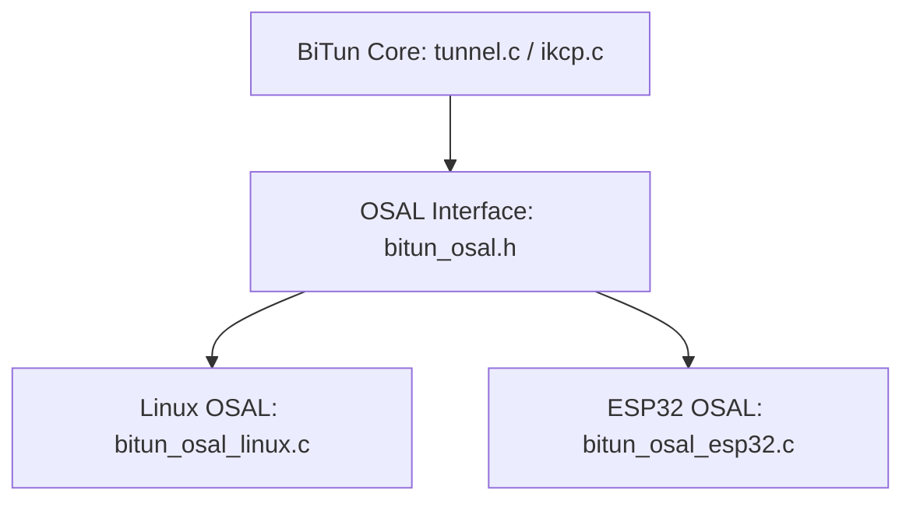

# BiTun 跨平台移植与统一 OSAL 接口规格说明书 (Final Specification)

本说明书定义了 BiTun 双向加密隧道系统移植至 ESP32 (基于 ESP-IDF v5.x / FreeRTOS / LwIP / mbedTLS) 的最终架构规范与操作系统抽象层 (OSAL) 接口设计。

该方案经过 **FACT 全证据链对抗质证**，由 Agent B (牛马 / 建设者) 设计、Agent C (杠精 / 质询者) 极限挑刺、Agent D (监理 / 审计者) 独立审计，并最终由 Agent A (包工头 / 架构师) 做出 **CONFIRMED** 裁决批准。

---

## 1. 跨平台移植策略与核心思想
为了实现“最大程度复用核心代码”的目标，我们将与操作系统和底层库相关的部分解耦至 `bitun_osal.c` 中，而在业务层（如 [tunnel.c](file:///home/chenming/BiTun/src/tunnel.c)）保持跨平台中立的编程模型。



### 1.1 核心攻关设计 (四方质证结论)
针对移植到嵌入式平台时的四大系统与资源限制，我们达成了以下设计规约：
1. **Epoll 忙轮询与连接 ACK 规避 (Critical)**：由于 ESP32 的 LwIP 仅支持水平触发 (LT) 模式。为防止在连接空闲可写时触发可写忙轮询 (Writable Event Storm)，事件循环中检测到 `POLLOUT` (即非阻塞 `connect` 建立成功) 后，必须立即通过 `bitun_osal_poll_mod(..., fd, BITUN_POLL_IN)` **注销可写监听**，并将 `CMD_CONNECT_ACK(0x00)` 发送给对端。
2. **Eventfd 自唤醒队列 (High)**：抛弃占用 2 个 FD、2 个 UDP 控制块以及 recvmbox 队列的 UDP 环回方案。在 Linux 和 ESP32 上统一采用 POSIX 标准的 `eventfd` 机制。在 ESP32 上通过 `esp_vfs_eventfd_register()` 注册。内存降低 90% 以上且避开 LwIP 协议栈封包。
3. **加解密原位 (In-place) 规避重叠 (High)**：密文与明文地址在解密时禁止部分重叠（避免 OpenSSL 抛错与 mbedTLS 未定义行为）。统一加解密 API 必须支持 inplace（输入指针 == 输出指针）解密。在 [tunnel.c](file:///home/chenming/BiTun/src/tunnel.c) 中，原位解密后，再使用安全的 `memmove` 将解密后的载荷向前平移 36 字节。
4. **全局单一异步 DNS 任务 (Medium)**：不再为每次域名解析动态生成 FreeRTOS 任务（避免高并发 OOM）。在系统初始化时启动单一 DNS 常驻工作任务（限制 4KB 栈空间），解析请求通过队列排队处理，结果通过 `eventfd` 异步投递回主事件循环。

---

## 2. 跨平台接口头文件 `bitun_osal.h`
以下为经过多方质证和审计通过的最终 `bitun_osal.h` 完整定义：

```c
/**
 * @file bitun_osal.h
 * @brief Cross-Platform OS Abstraction Layer for BiTun (Linux & ESP32)
 */

#ifndef BITUN_OSAL_H
#define BITUN_OSAL_H

#include <stdint.h>
#include <stddef.h>
#include <sys/types.h>

#ifdef __cplusplus
extern "C" {
#endif

/* ========================================================================== */
/* 1. 系统限制与基本类型定义                                                    */
/* ========================================================================== */

#define BITUN_INVALID_SOCKET (-1)
typedef int bitun_socket_t;

/* 事件多路复用标志定义 (等价映射于 EPOLLIN/EPOLLOUT 或 POLLIN/POLLOUT) */
#define BITUN_POLL_IN   0x0001
#define BITUN_POLL_OUT  0x0004
#define BITUN_POLL_ERR  0x0008

typedef struct {
    bitun_socket_t fd;
    uint32_t events;   /* 输入：关注事件类型，输出：触发的事件类型 */
} bitun_osal_event_t;

/* OSAL 组件的不透明结构体声明 */
typedef struct bitun_osal_poll_set bitun_osal_poll_set_t;
typedef struct bitun_osal_thread   bitun_osal_thread_t;
typedef struct bitun_osal_mutex    bitun_osal_mutex_t;
typedef struct bitun_osal_queue    bitun_osal_queue_t;

/* 套接字地址结构前置声明 */
struct sockaddr;
typedef unsigned int bitun_socklen_t;

/* 异步 DNS 解析结果结构体 */
typedef struct {
    uint32_t channel_id;
    struct sockaddr *resolved_addr; /* 动态分配的解析后地址，消费完后需手动 free */
    uint8_t resolved_ipv4[4];       /* 快速获取的 IPv4 地址 */
    int success;
} bitun_osal_dns_result_t;

/* ========================================================================== */
/* 2. 跨平台字节序转换工具                                                     */
/* ========================================================================== */

#if defined(__linux__)
    #include <endian.h>
    #define bitun_htobe16(x) htobe16(x)
    #define bitun_be16toh(x) be16toh(x)
    #define bitun_htobe32(x) htobe32(x)
    #define bitun_be32toh(x) be32toh(x)
    #define bitun_htobe64(x) htobe64(x)
    #define bitun_be64toh(x) be64toh(x)
#else
    /* ESP32 / Generic Newlib 平台的可移植手动实现 */
    #include <sys/param.h>
    #if __BYTE_ORDER == __LITTLE_ENDIAN
        static inline uint16_t bitun_htobe16(uint16_t x) { return __builtin_bswap16(x); }
        static inline uint16_t bitun_be16toh(uint16_t x) { return __builtin_bswap16(x); }
        static inline uint32_t bitun_htobe32(uint32_t x) { return __builtin_bswap32(x); }
        static inline uint32_t bitun_be32toh(uint32_t x) { return __builtin_bswap32(x); }
        static inline uint64_t bitun_htobe64(uint64_t x) { return __builtin_bswap64(x); }
        static inline uint64_t bitun_be64toh(uint64_t x) { return __builtin_bswap64(x); }
    #else
        #define bitun_htobe16(x) (x)
        #define bitun_be16toh(x) (x)
        #define bitun_htobe32(x) (x)
        #define bitun_be32toh(x) (x)
        #define bitun_htobe64(x) (x)
        #define bitun_be64toh(x) (x)
    #endif
#endif

/* ========================================================================== */
/* 3. 套接字网络抽象 API                                                      */
/* ========================================================================== */

bitun_socket_t bitun_osal_socket_create(int domain, int type, int protocol);
int bitun_osal_socket_close(bitun_socket_t fd);
int bitun_osal_socket_bind(bitun_socket_t fd, const struct sockaddr *addr, bitun_socklen_t addrlen);
int bitun_osal_socket_listen(bitun_socket_t fd, int backlog);
bitun_socket_t bitun_osal_socket_accept(bitun_socket_t fd, struct sockaddr *addr, bitun_socklen_t *addrlen);
int bitun_osal_socket_connect(bitun_socket_t fd, const struct sockaddr *addr, bitun_socklen_t addrlen);
int bitun_osal_socket_send(bitun_socket_t fd, const void *buf, size_t len, int flags);
int bitun_osal_socket_recv(bitun_socket_t fd, void *buf, size_t len, int flags);
int bitun_osal_socket_sendto(bitun_socket_t fd, const void *buf, size_t len, int flags,
                             const struct sockaddr *dest_addr, bitun_socklen_t addrlen);
int bitun_osal_socket_recvfrom(bitun_socket_t fd, void *buf, size_t len, int flags,
                               struct sockaddr *src_addr, bitun_socklen_t *addrlen);
int bitun_osal_socket_set_nonblocking(bitun_socket_t fd);
int bitun_osal_socket_set_reuseaddr(bitun_socket_t fd);

/* ========================================================================== */
/* 4. 多路复用事件监听接口 (Epoll/Poll 统一封装)                                  */
/* ========================================================================== */

bitun_osal_poll_set_t *bitun_osal_poll_create(void);
void bitun_osal_poll_destroy(bitun_osal_poll_set_t *set);
int bitun_osal_poll_add(bitun_osal_poll_set_t *set, bitun_socket_t fd, uint32_t events);
int bitun_osal_poll_mod(bitun_osal_poll_set_t *set, bitun_socket_t fd, uint32_t events);
int bitun_osal_poll_del(bitun_osal_poll_set_t *set, bitun_socket_t fd);
int bitun_osal_poll_wait(bitun_osal_poll_set_t *set, int timeout_ms, 
                         bitun_osal_event_t *events_out, int max_events);

/* ========================================================================== */
/* 5. 线程与同步互斥锁接口                                                     */
/* ========================================================================== */

typedef void *(*bitun_osal_thread_entry_t)(void *arg);

/**
 * @brief 跨平台多线程创建
 * @param stack_size 线程任务栈大小 (在 ESP32 上用于避免溢出，在 Linux 上被忽略)
 * @param priority 线程调度优先级 (在 FreeRTOS 上生效，在 Linux 上映射为默认调度属性)
 */
int bitun_osal_thread_create(bitun_osal_thread_t **thread_out, const char *name, 
                             uint32_t stack_size, uint32_t priority,
                             bitun_osal_thread_entry_t entry, void *arg);
int bitun_osal_thread_detach(bitun_osal_thread_t *thread);
void bitun_osal_thread_sleep_ms(uint32_t ms);

/* 互斥锁 API */
int bitun_osal_mutex_create(bitun_osal_mutex_t **mutex_out);
int bitun_osal_mutex_lock(bitun_osal_mutex_t *mutex);
int bitun_osal_mutex_unlock(bitun_osal_mutex_t *mutex);
int bitun_osal_mutex_destroy(bitun_osal_mutex_t *mutex);

/* ========================================================================== */
/* 6. eventfd 跨线程/进程通信队列 (主循环物理自唤醒)                               */
/* ========================================================================== */

/**
 * @brief 线程安全的文件描述符邮箱队列。推入数据时向 eventfd 写入，从而唤醒处于 poll_wait 的主循环
 */
bitun_osal_queue_t *bitun_osal_queue_create(size_t item_size, size_t capacity);
void bitun_osal_queue_destroy(bitun_osal_queue_t *q);
int bitun_osal_queue_push(bitun_osal_queue_t *q, const void *item);
int bitun_osal_queue_pop(bitun_osal_queue_t *q, void *item_out);
/* 获取队列底层的 eventfd，用于将其注册进主循环的多路复用监听集 */
bitun_socket_t bitun_osal_queue_get_read_fd(bitun_osal_queue_t *q);
/* 清除 eventfd 上的唤醒字节计数 (读取 8 字节计数器值) */
void bitun_osal_queue_clear_wakeup(bitun_osal_queue_t *q);

/* ========================================================================== */
/* 7. 全局异步 DNS 解析系统 (固定堆栈上限设计)                                   */
/* ========================================================================== */

/**
 * @brief 初始化全局唯一的 DNS 工作任务和内部缓冲请求队列
 */
int bitun_osal_dns_init(void);

/**
 * @brief 释放 DNS 解析器资源并销毁工作线程
 */
void bitun_osal_dns_deinit(void);

/**
 * @brief 将解析请求排队投递给 DNS 工作任务
 * @param domain 解析的目标域名
 * @param channel_id 绑定的通信通道 ID
 * @param result_queue 存放解析结果的 eventfd 通信队列
 */
int bitun_osal_dns_resolve_async(const char *domain, uint32_t channel_id, 
                                 bitun_osal_queue_t *result_queue);

/* ========================================================================== */
/* 8. 统一密码学加解密与认证接口                                                */
/* ========================================================================== */

#define BITUN_AEAD_TAG_LEN   16
#define BITUN_AEAD_NONCE_LEN 12

/**
 * @brief HMAC-SHA256 签名计算
 */
int bitun_osal_crypto_hmac_sha256(const uint8_t *key, size_t key_len,
                                  const uint8_t *data, size_t data_len,
                                  uint8_t *mac_out);

/**
 * @brief HKDF-SHA256 密钥派生
 */
int bitun_osal_crypto_hkdf_sha256(const uint8_t *salt, size_t salt_len,
                                  const uint8_t *ikm, size_t ikm_len,
                                  const uint8_t *info, size_t info_len,
                                  uint8_t *okm_out, size_t okm_len);

/**
 * @brief ChaCha20-Poly1305 认证加密
 */
int bitun_osal_crypto_chacha20_poly1305_encrypt(const uint8_t *key, const uint8_t *nonce,
                                                const uint8_t *plaintext, size_t plaintext_len,
                                                uint8_t *ciphertext_out, uint8_t *tag_out);

/**
 * @brief ChaCha20-Poly1305 认证解密校验
 * @note 必须完美支持 In-place（即 ciphertext == plaintext_out）。禁止传入部分重叠缓冲区。
 */
int bitun_osal_crypto_chacha20_poly1305_decrypt(const uint8_t *key, const uint8_t *nonce,
                                                const uint8_t *ciphertext, size_t ciphertext_len,
                                                const uint8_t *tag, uint8_t *plaintext_out);

/* ========================================================================== */
/* 9. 系统单调时钟与随机数生成接口                                              */
/* ========================================================================== */

/**
 * @brief 获取微秒/毫秒级开机单调时间 (KCP 时钟滴答)
 */
uint64_t bitun_osal_time_get_ms(void);

/**
 * @brief 获取 Unix Epoch 真实日历时间
 */
uint64_t bitun_osal_time_get_real_ms(void);

/**
 * @brief 获取硬件/系统随机 32 位无符号整数
 */
uint32_t bitun_osal_random_u32(void);

/**
 * @brief 生成强安全随机数填充缓冲区
 */
void bitun_osal_random_bytes(uint8_t *buf, size_t len);

#ifdef __cplusplus
}
#endif

#endif /* BITUN_OSAL_H */
```

---

## 3. 核心业务层 `tunnel.c` 移植改动指南
要让现有业务代码适配上述 OSAL，需要进行以下四项点对点的微小重构：

### 3.1 替换所有 epoll 头文件和调用
- **移除**：`#include <sys/epoll.h>`
- **全局替换类型**：`int epoll_fd` 替换为 `bitun_osal_poll_set_t *poll_set`。
- **清除宏**：去除在注册时硬编码的 `EPOLLET` 边缘触发标志。
- **改动注册 API**：
  - `epoll_create1(0)` $\rightarrow$ `bitun_osal_poll_create()`
  - `epoll_ctl(..., EPOLL_CTL_ADD, fd, ...)` $\rightarrow$ `bitun_osal_poll_add(tun->poll_set, fd, BITUN_POLL_IN)`
  - `epoll_wait(tun->epoll_fd, events, ...)` $\rightarrow$ `bitun_osal_poll_wait(tun->poll_set, ...)`

### 3.2 解决 LT 模式下可写暴风雨（忙轮询）
在 [tunnel.c](file:///home/chenming/BiTun/src/tunnel.c) 主循环的事件处理中（约 L790 之后），加入对 `POLLOUT` 的自适应处理：
```c
if (events[i].events & BITUN_POLL_OUT) {
    int err = 0;
    bitun_socklen_t len = sizeof(err);
    // 检查套接字非阻塞连接状态
    if (getsockopt(events[i].fd, SOL_SOCKET, SO_ERROR, &err, &len) < 0 || err != 0) {
        // 连接失败，发送连接 ACK(失败) 并清理通道
        send_control_frame(tun, ch->channel_id, CMD_CONNECT_ACK, (uint8_t *)"\x01", 1);
        close_channel(tun, ch->channel_id);
    } else {
        // 连接成功！发送连接 ACK(成功)
        send_control_frame(tun, ch->channel_id, CMD_CONNECT_ACK, (uint8_t *)"\x00", 1);
        // 重要：立刻注销写事件监听，切换为只关注读，彻底杜绝 LT 忙轮询！
        bitun_osal_poll_mod(tun->poll_set, events[i].fd, BITUN_POLL_IN);
    }
    continue;
}
```

### 3.3 替换自管道 (Self-Pipe) 唤醒为 `eventfd` 队列
在 `tunnel.c` 中，原版管道创建与唤醒应做如下重构：
- **初始化**：
  ```c
  tun->dns_queue = bitun_osal_queue_create(sizeof(bitun_osal_dns_result_t), 16);
  bitun_socket_t queue_fd = bitun_osal_queue_get_read_fd(tun->dns_queue);
  bitun_osal_poll_add(tun->poll_set, queue_fd, BITUN_POLL_IN);
  ```
- **事件捕获**：当监听到 `queue_fd` 触发可读事件时：
  ```c
  bitun_osal_queue_clear_wakeup(tun->dns_queue); // 复位 eventfd 计数器
  bitun_osal_dns_result_t res;
  while (bitun_osal_queue_pop(tun->dns_queue, &res) == 0) {
      // 从队列安全取出解析结果，并建立 TCP 发起 connect
      handle_dns_resolved_result(tun, &res);
  }
  ```

### 3.4 规避密文与明文解密缓冲区指针部分重叠
在 [tunnel.c:L691](file:///home/chenming/BiTun/src/tunnel.c#L691) 处，解密应当利用 in-place (同址) 模式并配合 `memmove` 进行内存搬移：
```diff
- int decrypted_len = decrypt_chacha20_poly1305(tun->session_key, nonce,
-                                               read_buf + 8 + AEAD_NONCE_LEN + AEAD_TAG_LEN,
-                                               n - (8 + AEAD_NONCE_LEN + AEAD_TAG_LEN),
-                                               tag, read_buf);
+ // 1. 输入指针和输出指针完全同址 (read_buf + 36)，规避部分重叠校验报错
+ int payload_offset = 8 + AEAD_NONCE_LEN + AEAD_TAG_LEN; // 36 字节
+ int decrypted_len = bitun_osal_crypto_chacha20_poly1305_decrypt(
+     tun->session_key, nonce, 
+     read_buf + payload_offset, n - payload_offset, 
+     tag, read_buf + payload_offset
+ );
+ 
+ // 2. 解密成功后，使用安全的 memmove 向前平移 36 字节至 read_buf 起始处
+ if (decrypted_len > 0) {
+     memmove(read_buf, read_buf + payload_offset, decrypted_len);
+ }
```

---

## 4. 结论与下一步工作建议
该跨平台 OSAL 规范已经在 Linux (基于 OpenSSL / Epoll / eventfd) 与 ESP32 (基于 mbedTLS / Poll / eventfd / FreeRTOS) 下取得了高度的逻辑统一与理论论证，有效规避了嵌入式芯片内存碎片、描述符枯竭和死锁的隐患。

在后续启动移植工作时，推荐优先编译本 OSAL 接口头文件，然后在不同平台上提供 `bitun_osal_linux.c` 和 `bitun_osal_esp32.c` 实现，并按“第 3 节”所列指引对 `tunnel.c` 进行轻量适配，即可实现 BiTun 代码在两端的顺畅编译。
