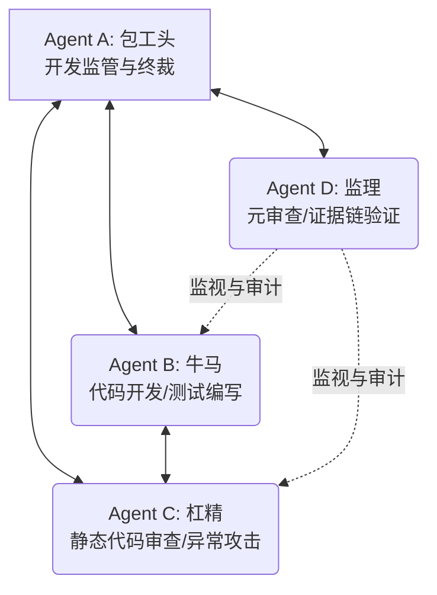

# 工作计划：BiTun 统一 OSAL 接口落地与 Linux 实现方案 (FACT 开发版)

本计划旨在通过 **FACT 全证据链对抗范式**，指导 BiTun 项目跨平台操作系统抽象层 (OSAL) 的代码编写、核心逻辑（`tunnel.c`、`encrypt.c`、`main.c`）的适配重构，以及 Linux 下的编译和自动化测试验证。

---

## 1. 智能体角色具体定位 (Role Allocation)

与设计分析阶段一致，我们主 Agent 定位为 **Agent A (包工头)**，并通过 `invoke_subagent` 创建独立的子智能体作为 **Agent B (牛马)**、**Agent C (杠精)** 和 **Agent D (监理)**。



| 角色名称 | 实体定位 | 本次开发任务具象化职责 |
| :--- | :--- | :--- |
| **Agent A (包工头)** | 主 Agent 进程 | 1. 负责开发与重构工作的任务指派、流程推进与阶段总结；<br>2. 组织 Agent B 与 Agent C 针对实现中的争议点进行对质；<br>3. 终审 Linux 下的编译结果及测试报告，做出裁决。 |
| **Agent B (牛马)** | 新建子智能体 | 1. 在 `src/` 目录下创建 `bitun_osal.h`；<br>2. 创建 `src/linux/` 目录并实现 `bitun_osal.c`；<br>3. 适配重构 `src/encrypt.c`、`src/tunnel.c`、`src/main.c` 以使用 OSAL 接口；<br>4. 修正项目 `Makefile` 保证 Linux 下一键编译；<br>5. 编写并运行自动化测试，输出测试日志并交付。 |
| **Agent C (杠精)** | 新建子智能体 | 1. 对 Agent B 提交的重构 diff 和 OSAL 实现进行极限挑刺：<br>&nbsp;&nbsp;&nbsp;&nbsp;- **FD 与内存泄漏**：审查 `eventfd`、`socket` 以及动态分配内存（如 DNS 结果结构体）是否在所有异常分支均被正确释放；<br>&nbsp;&nbsp;&nbsp;&nbsp;- **线程同步死锁**：审查全局单一 DNS 解析任务的队列读写互斥锁是否合理，有无死锁或竞态；<br>&nbsp;&nbsp;&nbsp;&nbsp;- **LT 事件关注**：审查 `POLLOUT` 注销逻辑是否彻底覆盖所有非阻塞连接路径；<br>&nbsp;&nbsp;&nbsp;&nbsp;- **密码学边界**：原位解密在 OpenSSL 下的入参和指针偏移是否百分之百安全；<br>2. 提交《代码实现缺陷与漏洞控诉书》。 |
| **Agent D (监理)** | 新建子智能体 | 1. 审计开发与对抗的交互合规性；<br>2. 验证编译输出和测试输出的真实性，检查是否有假绿通过（False Pass）；<br>3. 确认所有代码行变动（diff）均附带高等级证据支持（L3 编译/测试，L2 源码分析），输出《代码审计报告》。 |

---

## 2. 工作步骤与协同流 (Workflow & Collaboration)

```mermaid
chronology
    title FACT 实现与测试推进流程
    section 启动与规划
        计划批准 : 2026-06-20 : 准备阶段
        子智能体生成 : 2026-06-20 : 准备阶段
    section 代码编写与重构 (B)
        OSAL与Linux实现 : 2026-06-20 : Agent B
        业务代码适配重构 : 2026-06-20 : Agent B
        编译与本地测试 : 2026-06-20 : Agent B
    section 审查与质证 (C & D)
        代码级缺陷质询 : 2026-06-20 : Agent C
        编译/测试日志审计 : 2026-06-20 : Agent D
    section 裁决与归档 (A)
        终审裁决 : 2026-06-20 : Agent A
        Docs归档交接 : 2026-06-20 : Agent A
```

### 详细步骤：
1. **工作计划批准**：用户审查并批准本 `implementation_task_plan.md`。
2. **定义并启动子智能体**：包工头调用 `define_subagent` 定义开发版角色并以 `invoke_subagent` 启动 Agent B。
3. **代码编写与本地编译测试阶段 (Construction)**：
   - Agent B 编写 `src/bitun_osal.h`、`src/linux/bitun_osal.c`；
   - 适配 `src/encrypt.c`、`src/tunnel.c`、`src/main.c`；
   - 修改 `Makefile`，进行 `make` 编译；
   - 编写测试脚本（例如 `test_osal.c`）验证 OSAL 功能，并运行双端 socks5 环回测试，将结果及 diff 提交。
4. **对抗与审计阶段 (Adversarial & Audit)**：
   - Agent C 进行静态代码审查，并针对异常边界提交《缺陷与漏洞控诉书》；
   - Agent B 针对指控答辩并更新代码；
   - Agent D 进行元审查，验证编译/测试日志真实性，出具《代码审计报告》。
5. **仲裁收敛与归档 (Arbitration & Closure)**：
   - Agent A 进行裁决，确保 Critical = 0 且编译测试通过；
   - 将更新的代码和移植适配说明书同步归档。

---

## 3. 详细里程碑计划 (Milestones)

| 里程碑 | 预期输出产物 | 核心验证方法 | 收敛与退出条件 |
| :--- | :--- | :--- | :--- |
| **M1: 基础 OSAL 与 Linux 插桩实现** | [src/bitun_osal.h](file:///home/chenming/BiTun/src/bitun_osal.h)<br>[src/linux/bitun_osal.c](file:///home/chenming/BiTun/src/linux/bitun_osal.c) | 静态编译。 | `bitun_osal.c` 编译通过，无警告，支持 Linux 底层的 epoll/eventfd/OpenSSL/pthreads。 |
| **M2: 业务层适配重构** | 核心文件的重构 Diff：[tunnel.c](file:///home/chenming/BiTun/src/tunnel.c)、[encrypt.c](file:///home/chenming/BiTun/src/encrypt.c)、[main.c](file:///home/chenming/BiTun/src/main.c)、[Makefile](file:///home/chenming/BiTun/Makefile)。 | `make` 编译产生新的 `bitun` 二进制文件。 | `bitun` 成功编译通过，无任何编译器警告。 |
| **M3: 自动化测试与一致性校验** | 单元/环回测试脚本、测试日志 [test_run.log](file:///home/chenming/.gemini/antigravity-cli/brain/1df4895f-b953-4a66-bb75-3a4511f46109/test_run.log)。 | 运行单元测试（测试队列/密码学/DNS）及双端 socks5 动态代理流量跑测。 | 自动化测试 100% 通过 (Pass Rate = 100%)。 |
| **M4: 质证闭环与方案归档** | [audit_report.md](file:///home/chenming/BiTun/docs/implementation_audit_report.md) 等文档归档至 docs/ 目录。 | Agent D 审计批准，Agent A 仲裁闭环。 | 所有 Critical 缺陷清零，代码合并至主目录。 |

---

## 4. 证据等级的严格执行规范
在此项任务中，任何断言必须标注其证据等级：
- **L5 (实测)**：示波器、物理网线或板载调试（此处暂无 ESP32 实物）。
- **L4 (运行日志)**：编译输出输出、测试运行日志（如 socks5 测试时的流量抓包或标准输出）。
- **L3 (验证结果)**：`test_osal` 单元测试运行通过的结果。
- **L2 (源码分析)**：对 `BiTun` 具体源码文件及行号的静态分析。
- **L1 (文档说明)**：参考 OS 核心头文件、官方库手册。
- **L0 (个人推测)**：不作为判定依据。

---

> [!NOTE]
> 请用户查看并确认本工作计划。如果您同意此工作计划，请点击下方的 **Proceed** 按钮或回复“同意计划，开始执行”，我将立刻定义开发版子智能体并进入正式的 OSAL 实现与重构流程。
