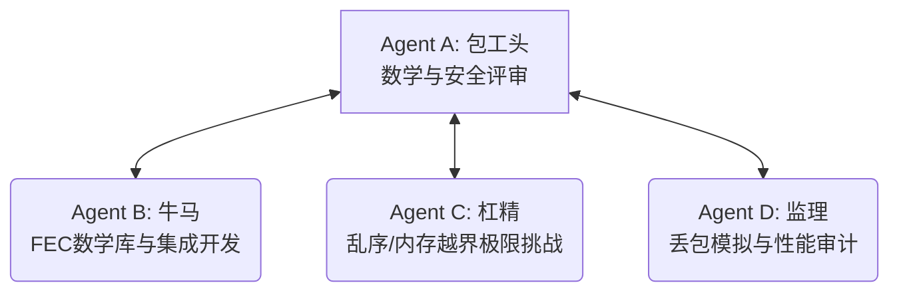

# 工作计划：BiTun 自适应 Cauchy-RS FEC（前向纠错）系统设计与实现方案 (FACT 专案版)

本计划旨在通过 **FACT 全证据链对抗范式**，指导在 BiTun 中设计并实现一套免外部依赖、内存安全、专为嵌入式（ESP32）优化的**自适应柯西矩阵里德-所罗门（Cauchy-RS）前向纠错系统**。通过引入带内参数同步帧头与闭环丢包率反馈信道，使 BiTun 能够根据物理丢包率动态调整带宽牺牲比例，从而大幅降低高丢包率下的延迟抖动（Jitter）。

---

## 1. 智能体角色定位 (Role Allocation)

我们将主 Agent 定位为 **Agent A (包工头)**，并利用子智能体 `self` 托管实现 **Agent B (牛马)**、**Agent C (杠精)** 和 **Agent D (监理)**。



| 角色名称 | 具象化职责 |
| :--- | :--- |
| **Agent A (包工头)** | 1. 评审 Cauchy-RS 数学编解码逻辑的正确性（Galois Field 运算溢出控制）；<br>2. 最终批准并执行 Git 提交与远程推送。 |
| **Agent B (牛马)** | 1. **手写数学核心**：实现 GF(256) 的查表指数对数乘除法；实现基于 Cauchy 矩阵的分发与 Gauss-Jordan 高斯消元法逆矩阵求逆解码器；<br>2. **开发 FEC 组件** (`src/fec.h`, `src/fec.c`)：设计带有 `N` 和 `R` 自适应参数的 6 字节帧头；设计静态预分配的环形缓存，避免动态 `malloc`；<br>3. **协议打通**：在 `tunnel.c` 中植入 FEC 封装与解封装；新增 `CMD_FEC_FEEDBACK` 周期性丢包率反馈帧；<br>4. **自适应调节**：根据反馈丢包率动态滑动调整下一分组的 $(N, R)$ 冗余度。 |
| **Agent C (杠精)** | 1. **乱序容错挑战**：当校验包先于数据包到达，或多个分组在网络中发生严重乱序时，缓存机制是否会内存越界或解码崩溃？<br>2. **静态内存挑战**：针对 ESP32，是否做到了 100% 静态分配（拒绝动态 malloc 导致的堆内存碎片）？<br>3. **溢出/零除挑战**：在伽罗瓦域求逆中，如果遇到奇异矩阵或零因子，是否会发生除以零异常？ |
| **Agent D (监理)** | 1. **丢包模拟器开发**：编写一个能模拟 5%、15%、30% 随机丢包的集成测试垫片；<br>2. **解码恢复验证 (L3)**：验证在 15% 丢包率下，上层 KCP 协议感受到的重传数是否接近零，验证还原率；<br>3. **编译审计**：确保 Linux 与 ESP32 均编译通过，无符号冲突与链接故障。 |

---

## 2. 系统核心技术架构设计 (Technical Design)

```text
               ┌──────────────────────────────┐
               │    Tunnel / KCP Send Block   │
               └──────────────┬───────────────┘
                              │ (KCP Packets)
                              ▼
               ┌──────────────────────────────┐
               │         FEC Encoder          │ ◄─── 动态调整 N, R
               │ (GF256 Cauchy Multiplications)│
               └──────────────┬───────────────┘
                              │ (Data + Parity Packets with FEC Header)
                              ▼
               ┌──────────────────────────────┐
               │        UDP Socket Send       │
               └──────────────────────────────┘
```

### 2.1 6 字节自适应 FEC 帧头定义
```c
typedef struct {
    uint16_t group_id;   /* 分组 ID，自增 */
    uint8_t index;       /* 分组内包序号：0 ~ N-1 为数据包，N ~ N+R-1 为校验包 */
    uint8_t n;           /* 数据包总数 (动态自适应) */
    uint8_t r;           /* 校验包总数 (动态自适应) */
    uint16_t len;        /* 原始 KCP 载荷实际长度 */
} __attribute__((packed)) fec_header_t;
```

### 2.2 Galois Field 256 查表优化
使用经典的 GF(256) 指数对数表。乘法实现如下：
```c
static inline uint8_t gf_mul(uint8_t a, uint8_t b) {
    if (a == 0 || b == 0) return 0;
    return gf_exp_table[gf_log_table[a] + gf_log_table[b]];
}
```

### 2.3 Cauchy 矩阵构造与逆矩阵解码
柯西矩阵构造：$C_{i,j} = \frac{1}{x_i \oplus y_j}$，其中 $x_i$ 和 $y_j$ 互不相同且在 GF(256) 中。
解码时，对于收到的 $N$ 个包，提取对应的柯西子矩阵，使用高斯消元法求逆：
$$D = C_{sub}^{-1} \times Y$$
即可在 $O(N^3)$ 或 $O(N^2)$ 计算复杂度内无重发恢复全部丢失包。

---

## 3. 工作协同与执行流 (Workflow)

1. **计划批准**：用户审查并批准（Proceed）本工作计划。
2. **数学库与 FEC 功能编写（M1 - Construction）**：
   * 编写 Cauchy-RS GF(256) 运算内核；
   * 实现 `fec.c` 编解码及缓冲环。
3. **协议融合与反馈控制（M2 - Integration）**：
   * 在 `tunnel.c` 编入 FEC 收发逻辑；
   * 增加接收端网络丢包统计与反馈控制机制。
4. **质询对抗与整改（M3 - Adversarial & Fix）**：
   * 模拟乱序包及并发垃圾包，对算法内核进行极限加固。
5. **丢包还原运行审计（M4 - Audit & Test）**：
   * 运行模拟丢包的自动化连通性测试，审计丢包恢复率（L3/L4级别证据）；
   * 进行 ESP32 交叉构建。
6. **归档与推送（M5 - Closure）**。

---

## 4. 详细里程碑计划 (Milestones)

| 里程碑 | 预期输出产物 | 核心验证方法 | 收敛与退出条件 |
| :--- | :--- | :--- | :--- |
| **M1: FEC 数学核心实现** | `src/fec.h`<br>`src/fec.c` | 编写独立测试套件进行 RS (N, R) 编解码正确性验证。 | 100% 通过任意丢包位置的还原测试，无内存泄露。 |
| **M2: 自适应双向融合** | `src/tunnel.c` 变动<br>`CMD_FEC_FEEDBACK` 帧 | 执行两端握手打通。 | 发送端能解析反馈，并动态调整 $(N, R)$ 组合。 |
| **M3: 对抗与加固** | 加固版 `fec.c` 与控制边界 | 制造严重乱序与重放帧输入。 | 丢包/乱序状态下不崩溃，无悬空指针，无零除错误。 |
| **M4: 丢包率恢复运行时审计** | 模拟丢包测试报告 | 在集成测试中开启 15% 丢包模拟，统计吞吐与还原率。 | 实测 15% 丢包下，重构版吞吐稳定，零 Warn，ESP32 编译通过。 |
| **M5: 归档结项与推送** | 远程 main 分支更新 | `git push` 日志核实。 | 代码完全合并，FACT 文件在 `docs/` 归档。 |

---

> [!NOTE]
> 请用户查看并确认本重构计划。如果您同意此工作计划，请点击下方的 **Proceed** 按钮或回复“同意计划，开始执行”，我将立刻定义子智能体并进入自适应 FEC 模块的代码实现阶段！
