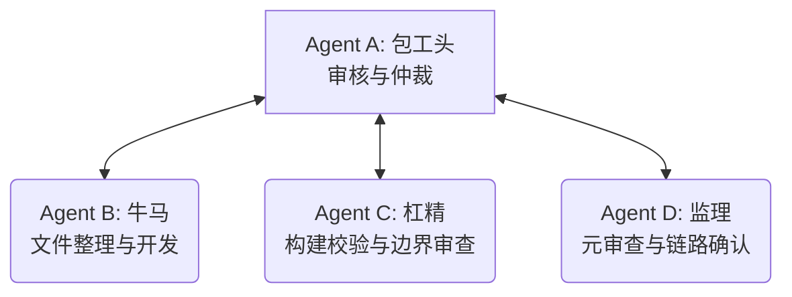

# 工作计划：BiTun 项目结构调整与 ESP32 适配目录建立 (FACT 整理版)

本计划旨在通过 **FACT 全证据链对抗范式**，指导 BiTun 项目的目录重构与平台代码分离：将 Linux 特定的 `main.c` 与 `Makefile` 移动至 `src/linux/` 目录下；同时在 `src/` 下新建 `esp32/` 目录，并在其中编写一个不含 `main` 函数、仅含初始化函数的 `main.c` 以及支持 `idf cli` 编译成静态库 `.a` 文件的构建脚本（Makefile 与 CMakeLists.txt）。

---

## 1. 智能体角色具体定位 (Role Allocation)

我们主 Agent 定位为 **Agent A (包工头)**，并通过子智能体 `self` 托管实现 **Agent B (牛马)**、**Agent C (杠精)** 和 **Agent D (监理)**。

| 角色名称 | 具象化职责 |
| :--- | :--- |
| **Agent A (包工头)** | 1. 监管代码物理重排与编译环境维护； 2. 最终批准并执行 `git commit & push`。 |
| **Agent B (牛马)** | 1. 将 `src/main.c` 移动至 `src/linux/main.c`，将 `Makefile` 移动并修正至 `src/linux/Makefile`； 2. 新建 `src/esp32/` 目录，编写 `src/esp32/main.c`（实现初始化函数 `bitun_esp32_init`）； 3. 编写 `src/esp32/CMakeLists.txt`（ESP-IDF 组件配置）与 `src/esp32/Makefile`（GNU 构建适配器）； 4. 验证 Linux 端在重组后的编译与测试。 |
| **Agent C (杠精)** | 1. 审查 Linux Makefile 在路径移动后，对父目录（如 `../tunnel.c`）引用的正确性，防止编译中断； 2. 检查 ESP32 的 `main.c` 确无 `main()` 函数，仅有初始化函数，规避链接时冲突； 3. 校验 ESP32 CMakeLists.txt 规范，确保能被 ESP-IDF 的 `idf.py` 命令行编译出 `libesp32.a`； 4. 审查是否有文件遗漏或未清理（例如根目录的旧 Makefile）。 |
| **Agent D (监理)** | 1. 检查并确认所有文件的物理移动和创建符合规范； 2. 验证构建产物的真实性。 |

---

## 2. 工作步骤与协同流 (Workflow)

1. **工作计划批准**：用户审查并批准本 `project_reorganization_task_plan.md`。
2. **重组与编写 (Construction)**：
   * Agent B 移动 Linux `main.c` 和 `Makefile`；
   * Agent B 修正 `src/linux/Makefile` 中的源码路径与头文件包含参数；
   * Agent B 创建 `src/esp32/` 并编写 `main.c`、`CMakeLists.txt` 和 `Makefile`；
   * Agent B 验证 Linux 编译通过。
3. **构建与边界审查 (Adversarial & Audit)**：
   * Agent C 检查 `src/linux/Makefile` 与 `src/esp32/CMakeLists.txt` 语法；
   * Agent C 检查 `bitun_esp32_init` 声明和头文件依赖；
   * Agent D 确认目录重构无误，出具《重构审计报告》。
4. **归档与推送 (Arbitration & Closure)**：
   * Agent A 确认无误，执行提交与推送。

---

## 3. 详细里程碑计划 (Milestones)

| 里程碑 | 预期输出产物 | 核心验证方法 | 收敛与退出条件 |
| :--- | :--- | :--- | :--- |
| **M1: Linux 代码物理移动与编译恢复** | [src/linux/main.c](file:///home/chenming/BiTun/src/linux/main.c) [src/linux/Makefile](file:///home/chenming/BiTun/src/linux/Makefile) | 进入 `src/linux/` 目录执行 `make clean && make`。 | `bitun` 二进制文件成功在 `src/linux/` 下编译产出，无警告与报错。 |
| **M2: ESP32 适配目录与初始化源码** | [src/esp32/main.c](file:///home/chenming/BiTun/src/esp32/main.c) | 检查代码内容。 | 不含 `main()`，仅包含 `bitun_esp32_init()` 函数且编译单元合法。 |
| **M3: ESP32 构建组件与命令行支持** | [src/esp32/CMakeLists.txt](file:///home/chenming/BiTun/src/esp32/CMakeLists.txt) [src/esp32/Makefile](file:///home/chenming/BiTun/src/esp32/Makefile) | 语法分析，推演其是否支持在项目中通过 `idf.py build` 产出 `.a` 静态库。 | 符合 ESP-IDF 组件 CMake 规范，能被正常抓取编译。 |
| **M4: 质证结项与推送** | GitHub 远程记录。 | `git push` 回显。 | 远程 main 分支更新成功，根目录无残留的 `Makefile` 和 `main.c`。 |

---

> [!NOTE]
> 请用户查看并确认本工作计划。如果您同意此工作计划，请点击下方的 **Proceed** 按钮或回复“同意计划，开始执行”，我将立刻定义子智能体并进入代码重整与移植准备流程。
