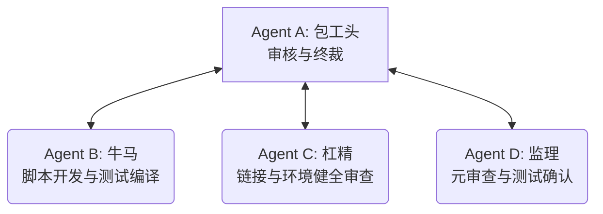

# 工作计划：BiTun ESP32 一键构建与清理脚本开发方案 (FACT 脚本版)

本计划旨在通过 **FACT 全证据链对抗范式**，指导在 `src/esp32/` 目录下开发一键构建脚本 `build.sh` 和清理脚本 `clean.sh` 的工作。为确保 `idf cli` (`idf.py`) 在该目录下编译顺利生成静态库 `.a` 文件，我们将构建一个极简的 ESP-IDF 工程脚手架（项目 CMakeLists.txt，以及仅含空入口函数 `app_main` 用于满足链接器需求的 `main/` 子目录），保证 `src/esp32/main.c` 本身只保留初始化逻辑且不包含任何主函数。

---

## 1. 智能体角色具体定位 (Role Allocation)

我们主 Agent 定位为 **Agent A (包工头)**，并通过子智能体 `self` 托管实现 **Agent B (牛马)**、**Agent C (杠精)** 和 **Agent D (监理)**。

| 角色名称 | 具象化职责 |
| :--- | :--- |
| **Agent A (包工头)** | 1. 监管脚本的功能交付与编译稳定性审查； 2. 最终批准并执行 `git commit & push`。 |
| **Agent B (牛马)** | 1. 编写 `src/esp32/build.sh`（载入环境变量并执行 `idf.py build`）； 2. 编写 `src/esp32/clean.sh`（执行 `idf.py fullclean`）； 3. 在 `src/esp32/` 建立项目级 `CMakeLists.txt`，并将 `main.c` 关联为组件源； 4. 新增 `src/esp32/main/app_main_dummy.c` 实现空 `app_main()` 解决链接报错； 5. 调用 ESP-IDF 环境测试编译并捕获生成 of `.a` 文件。 |
| **Agent C (杠精)** | 1. 审查 `main.c` 确无 `main`/`app_main`（保持初始化职责的单一性）； 2. 审查 `build.sh` 载入 `export.sh` 时对环境变量的兼容性； 3. 审查 `.a` 静态库（通常为 `libmain.a`）的输出路径是否正确； 4. 检查临时编译产物（如 `build/` 目录）是否能被 `clean.sh` 彻底清除。 |
| **Agent D (监理)** | 1. 验证编译生成的 `libmain.a` 文件真实性（L4/L3级别证据）； 2. 监控脚本对 ESP-IDF 环境依赖的正确解耦。 |

---

## 2. 工作步骤与协同流 (Workflow)

1. **工作计划批准**：用户审查并批准本 `project_scripts_task_plan.md`。
2. **重构与编写 (Construction)**：
   * Agent B 创建项目级 `src/esp32/CMakeLists.txt`；
   * Agent B 创建 `src/esp32/main/CMakeLists.txt` 并指向 `../main.c`；
   * Agent B 编写空链接入口 `src/esp32/main/app_main_dummy.c`；
   * Agent B 编写 `build.sh` 和 `clean.sh`；
   * Agent B 在本地执行 `./build.sh` 进行跑测。
3. **构建与边界审查 (Adversarial & Audit)**：
   * Agent C 检查桩代码与链接过程；
   * Agent D 审查 `.a` 文件物理属性，出具《脚本开发审计报告》。
4. **归档与推送 (Arbitration & Closure)**：
   * Agent A 确认无误，执行提交与推送。

---

## 3. 详细里程碑计划 (Milestones)

| 里程碑 | 预期输出产物 | 核心验证方法 | 收敛与退出条件 |
| :--- | :--- | :--- | :--- |
| **M1: 极简项目脚手架建立** | [src/esp32/CMakeLists.txt](file:///home/chenming/BiTun/src/esp32/CMakeLists.txt) (更新为项目级) [src/esp32/main/CMakeLists.txt](file:///home/chenming/BiTun/src/esp32/main/CMakeLists.txt) | 检查目录结构。 | 项目级和组件级 CMake 语法无冲突。 |
| **M2: 一键构建与清理脚本** | [src/esp32/build.sh](file:///home/chenming/BiTun/src/esp32/build.sh) [src/esp32/clean.sh](file:///home/chenming/BiTun/src/esp32/clean.sh) | 检查权限与代码包含。 | 脚本具有可执行权限，内部路径和信号载入正确。 |
| **M3: ESP32 本地测试编译** | [src/esp32/build/esp-idf/main/libmain.a](file:///home/chenming/BiTun/src/esp32/build/esp-idf/main/libmain.a) (编译产出) | 运行 `./build.sh`，检查生成物。 | 编译成功且成功生成静态链接库，无链接报错。 |
| **M4: 质证结项与推送** | GitHub 远程记录。 | `git push` 回显。 | 远程 main 分支更新成功，脚本被完全追踪。 |

---

> [!NOTE]
> 请用户查看并确认本工作计划。如果您同意此工作计划，请点击下方的 **Proceed** 按钮或回复“同意计划，开始执行”，我将立刻定义子智能体并进入脚本编写与编译测试流程。
