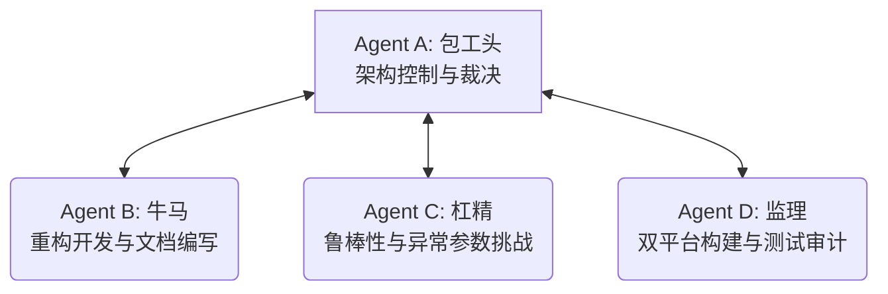
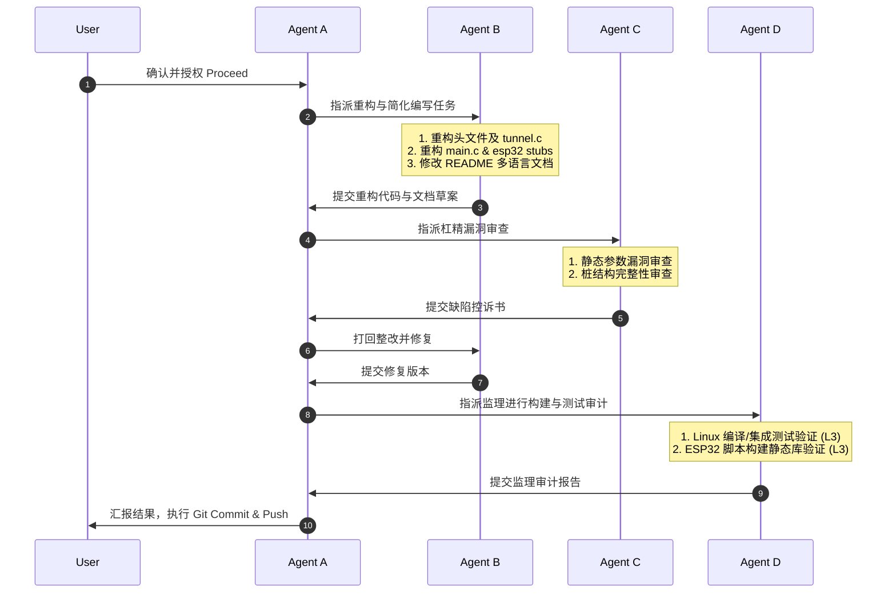

# 工作计划：BiTun 极简双向 SOCKS5 瑞士军刀重构方案 (FACT 简化版)

根据用户的最新要求，我们将废除所有冗余的静态端口转发模式（`-L` / `-R`），将 BiTun 彻底重构为**纯粹的对等双向 SOCKS5 隧道**（微内核流多路复用核心 + 本地 SOCKS5 协议栈包装）。这不仅可以大幅简化代码结构、缩小二进制体积，还能极大地降低 ESP32 等嵌入式设备上的代码移植和维护成本。

为了确保本次重构的质量和正确性，我们将启动 **FACT 全证据链对抗范式**。

---

## 1. 智能体角色定位 (Role Allocation)

我们将主 Agent 定位为 **Agent A (包工头)**，并利用子智能体 `self` 托管实现 **Agent B (牛马)**、**Agent C (杠精)** 和 **Agent D (监理)**。

| 角色名称 | 具象化职责 |
| :--- | :--- |
| **Agent A (包工头)** | 1. 审核简化设计的整体方向； 2. 最终批准并执行 Git 提交与远程推送。 |
| **Agent B (牛马)** | 1. 修改 `src/tunnel.h`：移除 `mapping_mode_t` 枚举及 `target_ip/port` 配置项； 2. 修改 `src/tunnel.c`：移除所有关于 `-L`/`-R` 的代码分支，只保留纯粹的 SOCKS5 处理流； 3. 修改 `src/linux/main.c`：移除 `-m`/`--mode` 和 `-t`/`--target` 参数，更新 CLI 参数解析和使用说明（Usage）； 4. 修改 `src/esp32/main.c`：根据修改后的 `tunnel_config_t` 同步更新桩初始化函数签名与实现； 5. 同步修改多语言 README 文档（`README.en.md`, `README.ja.md`）； 6. 本地执行编译，确保 Linux 编译成功并通过集成测试。 |
| **Agent C (杠精)** | 1. 审查命令行参数解析的鲁棒性（如果删除了 `-m`，输入非法参数是否能正确报错退出）； 2. 审查 `tunnel.c` 中接受新 TCP 连接时的逻辑，核实是否 100% 进入 SOCKS5 握手，无死锁； 3. 审查重构后对于不带 SOCKS5 协议的直连包处理是否已彻底剥离。 |
| **Agent D (监理)** | 1. 负责对 Linux PC 编译与 ESP32 交叉编译进行双端静态库构建审计； 2. 运行自动化集成测试脚本，并对流量连通性进行验证，出具《重构监理审计报告》。 |

---

## 2. 工作步骤与协同流 (Workflow)

1. **计划批准**：用户审查本计划并批准（Proceed）。
2. **重构编码（Construction）**：Agent B 对 `src/` 各代码文件和文档进行彻底重构，剔除静态转发逻辑。
3. **安全质证与整改（Adversarial & Fix）**：Agent C 评估重构的完备性与鲁棒性漏洞，Agent B 进行整改。
4. **编译与运行审计（Audit & Test）**：Agent D 执行 Linux 与 ESP32 双平台的测试构建，验证静态库生成和集成测试。
5. **发布与同步（Closure）**：Agent A 执行提交与远程推送。

---

## 3. 详细里程碑计划 (Milestones)

| 里程碑 | 预期输出产物 | 核心验证方法 | 收敛与退出条件 |
| :--- | :--- | :--- | :--- |
| **M1: 核心代码精简与重构** | `src/tunnel.h` `src/tunnel.c` `src/linux/main.c` `src/esp32/main.c` | 静态编译无 Warning 与 Error。 | 成功剔除所有 `-L` / `-R` 相关参数及逻辑，且只保留双向 SOCKS5 的处理流程。 |
| **M2: 多语言文档同步更新** | `README.en.md` `README.ja.md` | 内容行级校对与描述核实。 | README 中彻底移除 `-L`/`-R` 的描述，突出显示对等双向 SOCKS5 瑞士军刀的新设计。 |
| **M3: 双平台编译与集成测试** | `src/esp32/build/esp-idf/main/libmain.a` `src/linux/bitun` | 运行 `make` & `run_integration_test.sh` 运行 `src/esp32/build.sh` | Linux 和 ESP32 均编译通过，集成测试 100% Pass，无任何未决的 Critical 缺陷。 |
| **M4: 质证结项与 GitHub 推送** | Git 远程仓库最新 Commit。 | `git push` 回显日志核实。 | 代码顺利合并入 remote main 分支。 |

---

> [!NOTE]
> 请用户查看并确认本重构计划。如果您同意此工作计划，请点击下方的 **Proceed** 按钮或回复“同意计划，开始执行”，我将立刻启动子智能体进入具体的重构修改和测试验证流程。
