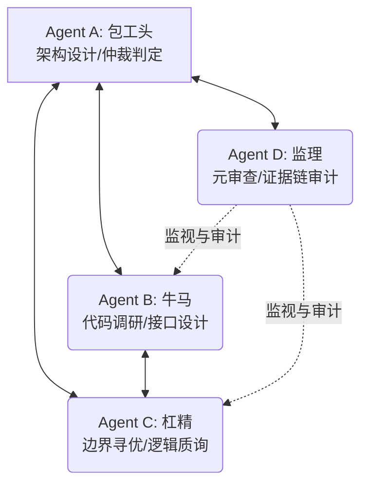

# 工作计划：BiTun 移植 ESP32 的系统分析与统一接口设计方案 (FACT 质证版)

本计划旨在通过 **FACT 全证据链对抗范式**，对项目 [BiTun](file:///home/chenming/BiTun) 进行系统性的移植可行性评估与操作系统抽象层 (OSAL) 接口设计。我们将首先梳理当前 Linux 环境下的系统依赖，对比其与 ESP32 (ESP-IDF / LwIP / FreeRTOS / mbedTLS) 的异同，并设计出最小修改原代码、最大化复用逻辑的跨平台统一抽象层接口。

---

## 1. 智能体角色具体定位 (Role Allocation)

根据 FACT 范式要求，我们将主 Agent 定位为 **Agent A (包工头)**，并通过 `define_subagent` 创建独立的子智能体进程作为 **Agent B (牛马)**、**Agent C (杠精)** 和 **Agent D (监理)**。



| 角色名称 | 实体定位 | 本次任务具象化职责 |
| :--- | :--- | :--- |
| **Agent A (包工头)** | 主 Agent 进程 | 1. 负责本任务的调度、流程把控与阶段总结；<br>2. 最终判定 Agent B 设计的接口在架构上是否优雅，是否真正实现“最大程度代码复用”；<br>3. 听取 Agent C 的质询与 Agent B 的答辩，做出最终的**确认(CONFIRMED)**或**拒绝(REJECTED)**裁决。 |
| **Agent B (牛马)** | 新建子智能体 | 1. 精细化阅读 `BiTun` 源码（如 `tunnel.c`、`encrypt.c`、`socks5.c`），定位所有 Linux 特定依赖（`epoll`、`pthread`、套接字选项、`openssl` 等）；<br>2. 搜集并对比 Linux 与 ESP32 (LwIP / FreeRTOS / mbedTLS) 接口的异同点；<br>3. 设计统一的 OS 抽象层接口（OSAL H 头文件），撰写《系统异同分析与统一接口设计草案》。 |
| **Agent C (杠精)** | 新建子智能体 | 1. 针对 Agent B 提交的草案，从以下维度发起冷酷的逻辑质询：<br>&nbsp;&nbsp;&nbsp;&nbsp;- **内存限制**：ESP32 SRAM 极度受限（通常约 320KB），大缓冲区和复杂抽象层是否导致 OOM？<br>&nbsp;&nbsp;&nbsp;&nbsp;- **事件模型**：Linux `epoll` 是边缘触发/事件驱动，ESP32 仅原生支持 `select/poll`（且 `FD_SETSIZE` 较小），两者的事件驱动模式如何高性能转换？是否会丢失事件？<br>&nbsp;&nbsp;&nbsp;&nbsp;- **加密算法**：OpenSSL 与 mbedTLS 的 API 差异，如何抽象不增加额外内存拷贝？<br>&nbsp;&nbsp;&nbsp;&nbsp;- **并发模型**：FreeRTOS 任务与 POSIX 线程 (pthread) 的抽象成本。<br>2. 输出《接口设计缺陷控诉书》。 |
| **Agent D (监理)** | 新建子智能体 | 1. 对 Agent B 的方案和 Agent C 的质询进行元审计；<br>2. 监督双方的论点，检查是否包含 L0 (个人推测)，要求必须基于 L1-L5 级别证据（如代码行引用、ESP-IDF 官方 API 文档、RFC 规范等）；<br>3. 输出《审计意见报告》，向包工头提交关于对抗质量的评估。 |

---

## 2. 工作步骤与协同流 (Workflow & Collaboration)

```mermaid
chronology
    title FACT 协作与质证推进流程
    section 启动与分析
        计划批准 : 2026-06-20 : 准备阶段
        子智能体生成 : 2026-06-20 : 准备阶段
    section 调研与设计 (B)
        代码依赖调研 : 2026-06-20 : Agent B
        接口与架构设计 : 2026-06-20 : Agent B
    section 质证与对抗 (C & D)
        缺陷与漏洞质询 : 2026-06-20 : Agent C
        证据审计与元审查 : 2026-06-20 : Agent D
    section 裁决与收敛 (A)
        仲裁辩论 : 2026-06-20 : Agent A
        最终方案交付 : 2026-06-20 : Agent A
```

### 详细步骤：
1. **工作计划批准**：用户审查本 `task_plan.md`，确认角色与目标。
2. **定义并启动子智能体**：
   - 包工头（Agent A）调用 `define_subagent` 分别定义 `bitun_builder`、`bitun_antagonist` 和 `bitun_auditor`。
   - 调用 `invoke_subagent` 启动它们。
3. **调研与方案设计阶段 (Construction)**：
   - Agent B 负责分析 `BiTun` 中所有平台相关的部分，撰写《BiTun 平台依赖性调研报告》；
   - Agent B 设计并提供跨平台统一接口（C 头文件形式，如 `bitun_osal.h`），说明移植时这些接口在 Linux (Epoll/OpenSSL) 和 ESP32 (LwIP/mbedTLS/FreeRTOS) 上的插桩/实现逻辑，然后提交给 Agent A 审批。
4. **对抗与审计阶段 (Adversarial)**：
   - Agent C 对 Agent B 的方案进行全方位挑刺，提交《设计缺陷控诉书》，关注点必须包括 **Epoll 状态机退化为 select/poll 的行为一致性**、**内存敏感性**、**加密 API 统一性**和**线程安全度**。
   - Agent B 针对控诉书进行逐条答辩，补充实现细节或修改接口设计。
   - Agent D 进行审计，判定质询是否属于“有效质询”（可达、可复现、有实质影响），过滤无效抬杠，并核实证据等级。
5. **仲裁与收敛阶段 (Arbitration & Closure)**：
   - Agent A 对未决争议进行 1 轮对质和终局裁决。
   - 裁决通过后，输出最终版《BiTun 跨平台移植可行性分析与 OSAL 接口定义说明书》作为最终交付物。

---

## 3. 详细里程碑计划 (Milestones)

| 里程碑 | 预期输出产物 | 核心验证方法 | 收敛与退出条件 |
| :--- | :--- | :--- | :--- |
| **M1: 项目依赖与平台异同分析** | [dependence_analysis.md](file:///home/chenming/.gemini/antigravity-cli/brain/1df4895f-b953-4a66-bb75-3a4511f46109/dependence_analysis.md) (由 Agent B 输出) | 静态代码分析，对比 Linux man 手册与 ESP-IDF LwIP API / mbedTLS API 文档。 | 梳理出 100% 的平台依赖点（Socket APIs、套接字选项、Epoll、Threads、OpenSSL）。 |
| **M2: OSAL 接口定义与设计草案** | [bitun_osal_design.md](file:///home/chenming/.gemini/antigravity-cli/brain/1df4895f-b953-4a66-bb75-3a4511f46109/bitun_osal_design.md) (由 Agent B 输出，含 `bitun_osal.h` 接口定义) | 静态逻辑推演，评估是否能最大程度复用 [tunnel.c](file:///home/chenming/BiTun/src/tunnel.c) 等核心代码。 | 核心文件 `tunnel.c` 除去打印和平台无关的逻辑后，需要实现“无需修改代码，仅通过替换底层 OSAL 库即可在两端编译”。 |
| **M3: 质证对抗与架构收敛** | [adversarial_report.md](file:///home/chenming/.gemini/antigravity-cli/brain/1df4895f-b953-4a66-bb75-3a4511f46109/adversarial_report.md) (包含 Agent C 的质询、Agent B 的答辩、Agent D 的审计和 Agent A 的裁决) | 针对内存、事件循环和加密映射的边界条件推演，确保无逻辑断点。 | 所有 Critical 缺陷和设计漏洞归零。轮次达到上限或连续无新增 High/Medium 问题。 |
| **M4: 最终交付方案** | [final_osal_spec.md](file:///home/chenming/.gemini/antigravity-cli/brain/1df4895f-b953-4a66-bb75-3a4511f46109/final_osal_spec.md) (最终归档，包含经过验证的 `bitun_osal.h` 和移植指南) | 用户审查并最终认可。 | 交付物格式规范，无逻辑漏洞，证据链闭环。 |

---

## 4. 证据等级的严格执行规范

在此项分析中，任何断言必须标注其证据等级：
- **L5 (实测)**：本任务阶段无实际硬件，L5 暂不适用。
- **L4 (运行日志)**：在 Linux 下运行 BiTun 的原始日志，或者 ESP32 测试日志（如有）。
- **L3 (验证结果)**：小型原型代码的编译或测试验证结果（例如验证 mbedTLS 与 OpenSSL 互通性、select 模拟 epoll 的测试代码）。
- **L2 (源码分析)**：直接引用 [BiTun 现有源码](file:///home/chenming/BiTun/src/)。
- **L1 (文档说明)**：引用 [LwIP 官方文档](https://savannah.nongnu.org/projects/lwip/)、[ESP-IDF 编程指南](https://docs.espressif.com/projects/esp-idf/zh_CN/latest/esp32/)、Linux manpages 及 RFC 规范。
- **L0 (个人推测)**：不作为判定依据。

---

> [!NOTE]
> 请用户查看并确认本工作计划。如果您同意此工作计划，请点击下方的 **Proceed** 按钮或回复“同意计划，开始执行”，我将立刻定义子智能体并进入移植分析与接口设计的正式流程。
